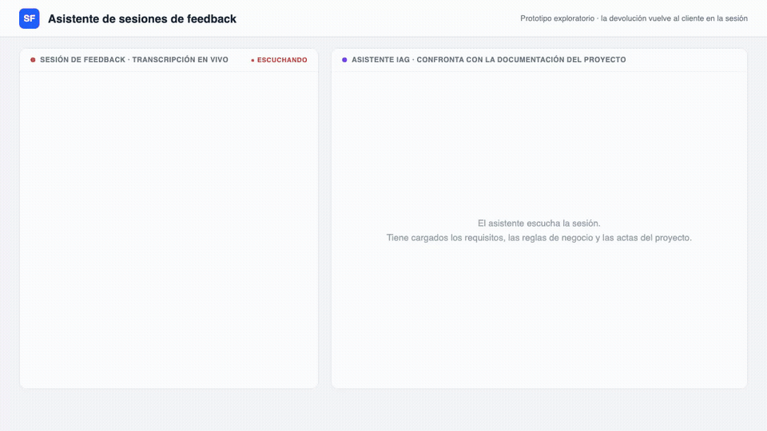

# Asistente de sesiones de feedback (idea elegida)

## Qué es

- La idea hacia la cual se trabaja, acordada con Daniel el 3/9: fusión de la línea de las ideas 2 y 3.
- El asistente escucha la sesión de feedback entre el cliente y el equipo, extrae lo que el cliente dice, lo confronta contra las reglas de negocio y los requisitos documentados del proyecto, y le devuelve la respuesta fundada en la propia sesión, con la cita de dónde choca cada punto y una priorización sugerida.
- Los tickets de alto nivel hacia el equipo son subproducto: no se desgranan en tareas y siempre los acepta un humano.
- El prototipo no mantiene la documentación actualizada, pero las conclusiones de cada sesión (reglas corregidas, excepciones confirmadas, tickets aceptados) quedan registradas en forma estructurada, como insumo para actualizarla después si se confirman.
- El mecanismo de consulta de la documentación queda a criterio: RAG, LLMWiki u otro.

## Qué punto de la tesis ataca

- Objetivo 2: la respuesta al cliente pasa de días a segundos (granularidad y temporalidad).
- Objetivo 3: el chequeo de consistencia que hoy hace el analista queda mediado por la IAG y el actor de negocio interactúa directo con la herramienta.
- Objetivo 4: cada choque contra lo acordado se detecta en la propia sesión (validación temprana).
- Objetivo 6: la prueba de concepto en sí, orientada a usuarios no técnicos.
- Diseñado sobre las cuatro barreras de Sharma et al.: base común, verificabilidad, informatividad y comunicación.

## Demo

Video completo en `demo.webm` (52 s). Mock auto-animado en `demo.html`.

- Dominio del ejemplo: una biblioteca universitaria y su sistema de préstamos. La directora es el cliente.
- La directora enuncia una regla que contradice una excepción registrada en un acta, y corrige su enunciado en la sesión.
- El bibliotecario dice algo que coincide con los requisitos y se confirma al instante.
- Un pedido nuevo (vencimiento automático de reservas) se encuadra como no contemplado, se prioriza y sale como ticket aceptado por el cliente.
- La documentación sintética de este proyecto inventado está en `../documentacion/`.
