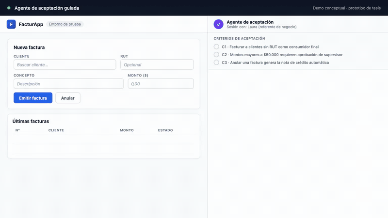

# Idea 1: Agente de aceptación guiada

## Qué es

- El stakeholder de negocio usa el software construido acompañado por un agente IAG.
- El agente le propone qué probar según los criterios de aceptación, en lenguaje de negocio.
- El stakeholder responde con sus palabras y el agente registra el veredicto criterio por criterio.
- Al final, el equipo de desarrollo recibe un reporte estructurado: qué se aceptó, qué se rechazó y por qué, trazado a cada criterio.

## Qué punto de la tesis ataca

- La instancia de aceptación: el stakeholder usa el software y valida si es lo que pidió. Las herramientas existentes generan artefactos; ninguna pone al stakeholder como validador.
- La IAG no genera código: media el ciclo de feedback de aceptación entre negocio y equipo de desarrollo.

## Validación liviana

- Proyecto ficticio chico (por ejemplo, un módulo de facturación con 3 a 5 criterios de aceptación).
- 5 a 15 usuarios de perfil de negocio recorren la sesión guiada por el agente.
- Formulario al cierre: claridad de las pruebas propuestas, confianza en el veredicto registrado, utilidad del reporte para el equipo.

## Demo

- `demo.html`: mock autocontenido y auto-animado (~50 segundos).
- `demo.webm`: grabación del recorrido completo en 1280x720.
