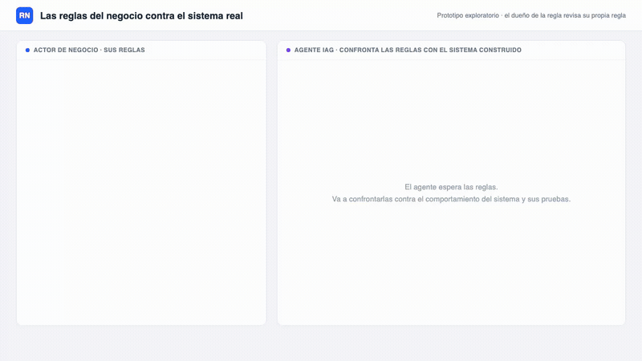
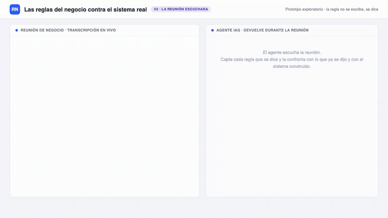

# Idea 2: Las reglas del negocio contra el sistema real

## Qué es

- El actor de negocio enuncia sus reglas en lenguaje natural, tal como las diría en una reunión.
- El agente IAG confronta esas reglas contra el sistema construido: inspecciona su comportamiento y sus pruebas.
- El sistema construido codifica excepciones reales que nadie enuncia en una reunión. Cada choque vuelve al negocio como pregunta: "acá se emiten notas de crédito sin aprobación de supervisor en devolución parcial con reintegro, ¿es un error del sistema o una excepción que la regla no contempla?".
- El actor de negocio resuelve caso por caso: corrige su propia regla o marca el error. Termina la sesión con su conjunto de reglas revisado.
- Lo que sale hacia el equipo de desarrollo es el resto, y es un subproducto.

## Qué punto de la tesis ataca

- La categoría "validar lo construido contra reglas y procesos de negocio", hoy vacía en la literatura.
- Objetivo D, validación temprana de reglas de negocio: el actor de negocio descubre en una sesión los huecos de sus propias reglas que hoy aparecen meses después, en producción o cuando un desarrollador pregunta por un caso borde.
- Objetivo C, transformación del rol: el actor de negocio interactúa directo con la herramienta generativa, sin traducir sus reglas a lenguaje técnico ni pasar por el analista.
- A diferencia de herramientas como GUISpector, que verifican prototipos GUI contra requisitos de forma automática, acá lo que se revisa es la regla de negocio y quien la revisa es su dueño.

---

## v1: las reglas escritas

Video completo en `demo.webm` (53 s). Mock auto-animado en `demo.html`.

- El actor de negocio escribe sus reglas y pide la confrontación con un botón.
- Es la versión más simple de construir y la más barata de validar: alcanza con gente escribiendo reglas, sin necesidad de coordinar reuniones.

### Validación

- Sesiones con 5 a 15 actores de negocio sobre un sistema de ejemplo con excepciones plantadas.
- Cada participante escribe sus reglas antes de ver el sistema y las revisa después de la confrontación.
- Métricas: cuántas reglas iniciales sobreviven sin cambios, cuántas reglas implícitas emergen recién en la confrontación, cuántos choques se clasifican como error del sistema y cuántos como regla incompleta.
- Contraste: el mismo sistema revisado por un analista sin la herramienta, para ver qué excepciones aparecen y cuáles no.

---

## v2: la reunión escuchada

Video completo en `demo-v2.webm` (47 s). Mock auto-animado en `demo-v2.html`.

- Nadie se sienta a escribir sus reglas de negocio: las dice en una reunión, de costado y mezcladas con otra cosa. Acá el agente escucha la reunión por STT y no le pide a nadie que escriba nada.
- Capta cada regla que se enuncia y la confronta en el momento, contra tres cosas a la vez:
  - **Lo que dijo otro participante.** Si Laura dice "toda nota de crédito requiere supervisor, sin excepción" y Marcos contesta "en devolución parcial la aprueba el cajero", no están diciendo la misma regla y hoy nadie lo nota.
  - **El sistema construido**, igual que en la v1.
  - **Lo acordado en actas previas.**
- La devolución llega en la frase siguiente, no al final del sprint. El acta sale de la reunión ya confrontada.

### Qué agrega sobre la v1

- Saca la artificialidad de pedirle al negocio que escriba reglas que en la práctica nunca escribe.
- Lleva la temporalidad del objetivo B al extremo: segundos entre lo dicho y la devolución, medible como dato del prototipo.
- Suma una fuente de discrepancia que la v1 no puede capturar: el choque entre dos actores de negocio que creían estar diciendo la misma regla. Es el material más directo para la alineación negocio-tecnología.

### Validación

- Más pesada que la de la v1: requiere reuniones, reales o simuladas con guión, en vez de gente completando un formulario.
- Sesiones grabadas con 3 a 6 grupos de 2 o 3 actores de negocio, sobre un sistema de ejemplo con excepciones plantadas y con un acta previa conocida.
- Métricas: cuántas reglas capta el agente sin corrección, cuántos choques entre participantes detecta contra los que un observador humano identifica en la misma grabación, cuántas reglas se corrigen dentro de la reunión, y la latencia entre la frase y la devolución.
- Decisión de diseño a estudiar, y no menor: si el agente interrumpe la reunión o solo deja la tarjeta en pantalla para que el grupo decida cuándo frenar. Cambia la dinámica social de la reunión y es en sí mismo un resultado.
