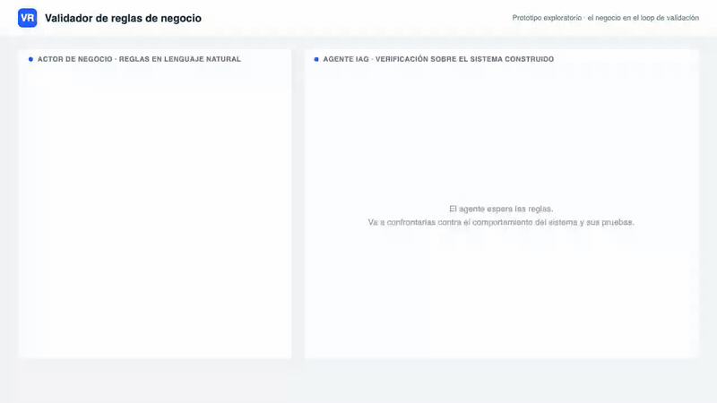

# Idea 2: Validador contra reglas de negocio

Video completo en `demo.webm` (45 s). Mock auto-animado en `demo.html` (abrir en un navegador a 1280x720).

## Qué es

- El actor de negocio escribe sus reglas en lenguaje natural, tal como las diría en una reunión.
- El agente IAG confronta esas reglas contra el sistema construido: inspecciona su comportamiento y sus pruebas (simulado en el demo).
- Las discrepancias vuelven en lenguaje de negocio, con el flujo concreto donde la regla no se cumple.
- El stakeholder confirma cada discrepancia o corrige su propia regla; lo confirmado se convierte en un ítem accionable para el equipo.

## Qué punto de la tesis ataca

- La categoría "validar lo construido contra reglas y procesos de negocio", hoy vacía en la literatura.
- A diferencia de herramientas como GUISpector, que verifican prototipos GUI contra requisitos de forma automática, acá el negocio está dentro del loop y lo que se chequea son reglas de negocio, no requisitos técnicos.

## Validación liviana

- Corridas automáticas sobre aplicaciones de ejemplo con reglas conocidas, sin usuarios.
- Se comparan las discrepancias que reporta el agente contra las violaciones plantadas a propósito en cada aplicación.
- Métricas simples: reglas violadas detectadas, falsos positivos y claridad de la explicación en lenguaje de negocio.
