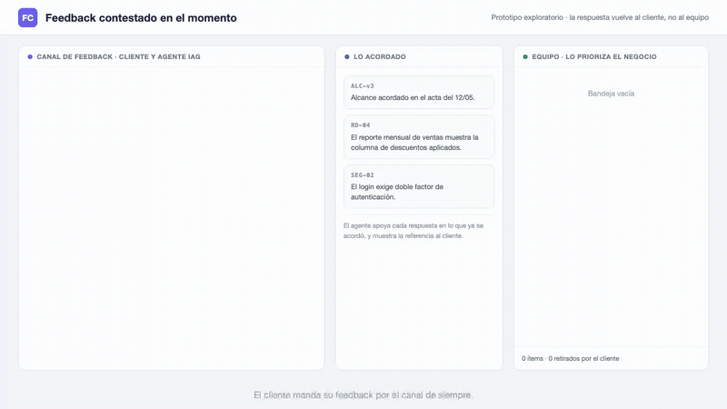

# Idea 3: Feedback contestado en el momento

Video completo en `demo.webm` (56 s). Mock auto-animado en `demo.html` (abrir en un navegador a 1280x720).

## Qué es

- El cliente manda su feedback por el canal de siempre: chat, mail, nota de reunión.
- El agente IAG le contesta al cliente en el momento, en vez de rutear el pedido al equipo dos semanas después. Cuatro tipos de respuesta:
  - **Pedido válido**: está completo y dentro de lo acordado. El agente lo confirma y pasa al equipo sin fricción. No toda respuesta es una objeción, y este es el caso que mantiene el canal usable.
  - **Contrapregunta**: el pedido está incompleto y el agente pregunta ahí mismo lo que hoy preguntaría un desarrollador tres días más tarde. El ítem llega completo porque lo completó el cliente.
  - **Juicio de alcance**: "esto ya está cubierto por lo acordado en X", o "esto queda fuera del alcance v3". El cliente retira, reformula o insiste antes de que el pedido entre a la cola del equipo.
  - **Bug de regla de negocio**: contradice una regla acordada y pasa al equipo con la traza a la conversación original.
- El agente sugiere el juicio de alcance, no lo decide, y puede equivocarse. Si el cliente insiste, el ítem pasa igual y queda marcado como discrepancia de alcance. Esa escalada es un dato del estudio: puede estar mostrando que el cliente pide de más, o que lo acordado quedó incompleto y el pedido era válido desde el principio. El prototipo no resuelve cuál de las dos es, la deja visible para que la negocien.
- La priorización queda del lado del negocio: el cliente ordena los ítems que sí pasaron, con los duplicados ya agrupados por el agente.

## Qué punto de la tesis ataca

- Objetivo B, temporalidad: la respuesta al cliente pasa de días a segundos, y el triage ocurre antes de que el pedido entre a la cola del equipo.
- Objetivo B, granularidad: el ítem llega completo porque el cliente lo completó, no porque el agente lo adivinó.
- Objetivo C, transformación de roles: el triage y la negociación de alcance son hoy trabajo del analista funcional. Acá los media la IAG y el cliente participa de ambos.
- Objetivo E, tiempos de ajuste y claridad de requerimientos.

## Qué la distingue de la idea 4

- La idea 4 es la sesión de aceptación, con el stakeholder usando el software delante del equipo.
- Esta es el canal asincrónico entre sesiones, donde hoy el feedback se acumula sin respuesta.

## Validación

- Sesiones con 5 a 15 actores de negocio sobre un sistema de ejemplo con un alcance acordado conocido de antemano. Cada participante manda su feedback por el canal.
- Métricas: cuántos pedidos reformula al recibir la contrapregunta, cuántos retira al ver el juicio de alcance, cuántos escala igual, y cuánto tarda en tener una respuesta contra el canal tradicional.
- Contraste: el mismo lote de feedback ruteado por un analista sin la herramienta, para comparar completitud del ítem y latencia de la respuesta.
