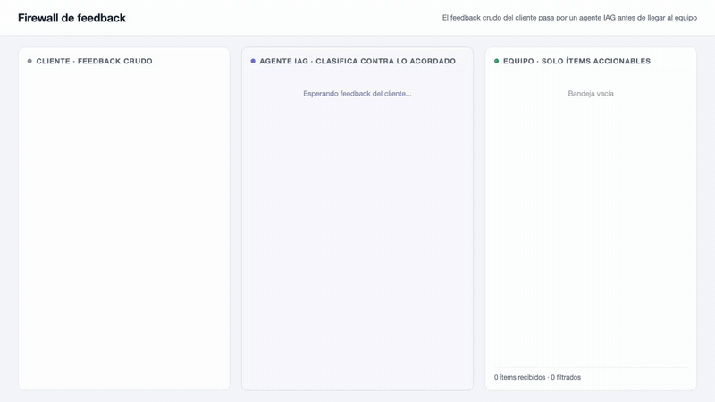

# Idea 3: Firewall de feedback

## Qué es

- El feedback crudo del cliente (chats, mails, notas de reunión) pasa por un agente IAG antes de llegar al equipo de desarrollo.
- El agente clasifica cada ítem contra lo acordado en el proyecto: bug de regla de negocio, cambio de alcance o ya cubierto por lo definido.
- Agrega justificación, prioridad y traza a la conversación original; el ruido y los duplicados no pasan.
- La IAG media la granularidad del feedback, no genera código.

## Qué punto de la tesis ataca

- Objetivo B: la granularidad y la temporalidad del ciclo de feedback. El equipo recibe menos ítems, más estructurados y en el momento en que son accionables.

## Validación liviana

- Corridas sobre issues históricos de repositorios reales, sin usuarios.
- Se toma el feedback crudo original (issues, comentarios) y se compara la clasificación del agente contra la resolución real de cada ítem.
- Métricas simples: acierto de clasificación, duplicados detectados, proporción de ruido filtrado.

## Demo

Video completo: [demo.webm](demo.webm)
