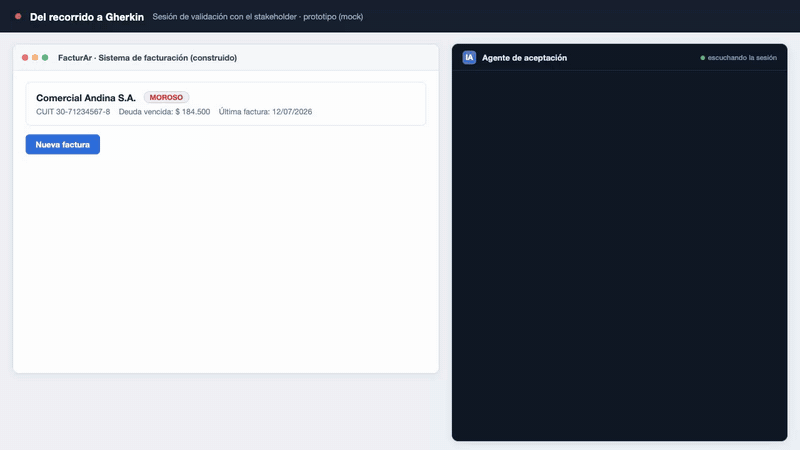

# Idea 4: Del recorrido a Gherkin

Video completo: [demo.webm](demo.webm)

## Qué es la idea

- Durante una sesión de validación, el stakeholder usa el software construido y comenta en voz alta lo que espera ("si el cliente está moroso, esto no me tendría que dejar facturar a crédito").
- El agente IAG convierte esos comentarios, en vivo, en escenarios de aceptación Gherkin (Given/When/Then).
- El agente relee cada escenario en lenguaje de negocio y el stakeholder confirma que capturó bien la expectativa.
- El equipo recibe tests de aceptación ejecutables, ya validados por el cliente.

## Qué punto de la tesis ataca

- La instancia de aceptación: el stakeholder usa el software y valida los criterios de aceptación él mismo.
- Lo distintivo: el stakeholder queda en el rol de validador de los criterios, no es el analista el que los redacta.

## Validación liviana

- Sesiones con 5 a 15 usuarios de negocio sobre un proyecto ficticio, cada uno recorre el sistema y comenta expectativas.
- Comparar los escenarios generados por el agente contra los redactados por un analista para el mismo recorrido.
- Medir cuántos escenarios confirma el stakeholder sin corrección y cuántos requieren reformulación.

## Archivos

- `demo.html`: mock autocontenido y auto-animado del flujo (abrir en un navegador, dura unos 40 segundos).
- `demo.webm`: grabación del demo en 1280x720.
- `demo.gif`: versión GIF para este README.
