 # BORRADOR — NO ES MATERIAL FINAL

 ### Es el registro de cómo fui pensando y trabajando el diagrama de ciclo de vida de software (ideas, idas y vueltas, versiones intermedias del diagrama Mermaid).

 ### El diagrama **final** lo hice yo a mano y está en `ciclo_de_vida_sw.png` (misma carpeta).

 ### Esto NO se cita ni se incluye en la tesis: es andamiaje de trabajo.

---

# Ciclo de vida de desarrollo de software — diagrama base (sin IAG)

> Documento de trabajo. Sirve para el **objetivo específico (A)**: caracterizar las
> dinámicas *tradicionales* de feedback técnico y de validación de procesos de negocio,
> antes de incorporar IAG.
>
> La capa con IAG (objetivos B, C, D) se construye **encima** de este diagrama, en un
> documento aparte, para poder contrastar "antes / después".

---

## 1. Para qué sirve este diagrama en la tesis

El objeto de estudio de la tesis **no son las fases**, sino los **ciclos de feedback**
que ocurren dentro y entre ellas (frecuencia, secuencia, granularidad, temporalidad —
objetivo B). Por eso el diagrama está organizado para que lo que "salte a la vista" sean
los *loops* anidados, y las fases sean el escenario donde esos loops viven.

Idea central: en el desarrollo moderno conviven **loops de distinta velocidad y
granularidad**, desde el ciclo de segundos del desarrollador hasta el ciclo de
semanas/meses de la evolución del producto.

---

## 2. La columna vertebral del flujo (síntesis defendible)

El flujo que propusiste —*discovery → prototipado → scrum*— es coherente con la práctica
actual y con los modelos canónicos. La síntesis:

1. **Discovery (descubrimiento).** El punto de partida real: hablar con el cliente,
   entender el problema/negocio, ayudarlo a pensar y **bajarlo a un PRD** (documento de
   requisitos de producto). Incluye elicitación de requisitos y descubrimiento de
   procesos/reglas de negocio.
   - Anclaje: actividad de *especificación* de Sommerville (2016); *Double Diamond*
     (Design Council); fases de *identificación* y *descubrimiento* del ciclo BPM
     (Dumas et al., 2018).

2. **Prototipado / validación temprana.** Materializar ideas en artefactos de baja/alta
   fidelidad para validarlas con el cliente *antes* de construir.
   - Anclaje: *modelo de prototipos* (Pressman & Maxim, 2020); ciclo
     *Build–Measure–Learn* (Ries, 2011).

3. **Entrega iterativa e incremental (Scrum).** Construir, integrar y validar en
   incrementos cortos, con feedback recurrente del Product Owner / cliente.
   - Anclaje: marco de proceso genérico —comunicación, planificación, modelado,
     construcción, despliegue— (Pressman & Maxim, 2020); *Scrum Guide*
     (Schwaber & Sutherland, 2020); actividades de *diseño/implementación* y
     *validación* de Sommerville (2016).

4. **Operación y evolución.** Lo entregado se usa, se monitorea y genera nuevos
   requisitos que reabren el ciclo.
   - Anclaje: actividad de *evolución* (Sommerville, 2016); fase de *monitoreo* del
     ciclo BPM (Dumas et al., 2018).

> Nota metodológica: las fases no son una cascada. Discovery y prototipado se solapan, y
> a lo largo de Scrum se sigue haciendo "mini-discovery". El diagrama muestra la
> dirección dominante, no una secuencia rígida.

---

## 3. Los ciclos de feedback (lo que vamos a estudiar)

> **Orden = cronología del ciclo de vida**, igual que el flujo del diagrama
> (izquierda→derecha). Empieza donde empieza un producto real: hablando con el cliente.
> Los loops técnicos (L3a/L3b) **no son el punto de partida**: están *anidados* dentro de
> la iteración y son los más rápidos, pero ocurren mucho después del primer contacto con
> el negocio.

| Loop | Quiénes | Frecuencia | Granularidad | Qué se valida / produce |
|---|---|---|---|---|
| **L1 — Discovery con el cliente** | 🟦 Cliente ↔ 🟨 Analista funcional | Días–semanas | Problema / necesidad | ¿Entendimos el problema y el negocio? → **PRD** |
| **L2 — Validación de prototipo** | 🟦 Cliente ↔ 🟨 Analista funcional | Días–semanas | Idea / hipótesis | ¿El prototipo es lo que el negocio necesita? |
| **L3 — Iteración (Sprint)** | 🟧 Product Owner ↔ 🟩 Equipo técnico | 1–4 semanas | Incremento | ¿El incremento cumple lo acordado? |
| &nbsp;&nbsp;↳ **L3a — Inner loop del dev** | 🟩 Desarrollador (solo) | Segundos–minutos | Línea / función | ¿Compila? ¿Pasan los tests locales? |
| &nbsp;&nbsp;↳ **L3b — Revisión técnica** | 🟩 Dev ↔ 🟩 Dev (PR / code review) | Horas–días | Cambio / feature | Calidad técnica, criterios de diseño |
| **L4 — Validación de reglas de negocio** | 🟨 Analista funcional ↔ 🟦 Cliente | Días–semanas | Regla / flujo / criterio de aceptación | ¿Refleja la regla de negocio real? |
| **L5 — Evolución del producto** | ⬜ Usuarios ↔ 🟦 Cliente / organización | Semanas–meses | Producto en uso | ¿El software sigue alineado al negocio? |

> Esta tabla es la que después "se rompe" con IAG: la hipótesis de la tesis es que la
> IAG **cambia la frecuencia, la secuencia, la granularidad y quién participa** en varios
> de estos loops — sobre todo los de negocio (**L1 discovery, L2 prototipo, L4 reglas**),
> donde el cliente podría empezar a interactuar directo con la herramienta generativa sin
> pasar siempre por el intermediario.

---

## 4. Roles (quién actúa)

Set de roles, centrado en los tres protagonistas del objetivo (C) + dos de apoyo:

| Rol | Código | Quién es | Dónde es protagonista |
|---|---|---|---|
| **Cliente / stakeholder de negocio** | 🟦 CLI | Dueño del problema y de las reglas de negocio | Discovery, validación de prototipo, sprint review |
| **Analista funcional** | 🟨 AF | Puente negocio↔técnico; traduce y valida requisitos | Discovery, validación de reglas, prototipado |
| **Equipo técnico (dev / QA)** | 🟩 DEV | Construye, integra y prueba el software | Construcción, pruebas, despliegue |
| **Product Owner** | 🟧 PO | Prioriza el backlog; representa al negocio en Scrum | Sprint planning, sprint review |
| **Usuarios finales** | ⬜ USR | Usan el software en producción | Operación / evolución |

> En el modelo tradicional, el negocio (CLI) casi nunca toca el producto directamente:
> siempre hay un intermediario (AF / PO / DEV). **Esa mediación es justo lo que la
> hipótesis de la tesis pone en cuestión con la IAG** (objetivo C).

---

## 5. Diagrama (Mermaid)

```mermaid
flowchart LR
    subgraph DISC["1 - Discovery"]
        D1["Elicitacion de requisitos --> PRD<br/>CLI - AF"]
        D2["Descubrimiento de procesos / reglas<br/>CLI - AF"]
    end

    subgraph PROTO["2 - Prototipado"]
        P1["Prototipo baja/alta fidelidad<br/>AF - DEV"]
        P2["Validacion con cliente<br/>CLI - AF"]
    end

    subgraph SCRUM["3 - Entrega iterativa - Scrum"]
        S1["Sprint planning<br/>PO - DEV"]
        S2["Construccion<br/>DEV"]
        S3["Pruebas / integracion<br/>DEV"]
        S4["Sprint review + validacion<br/>PO - CLI - DEV"]
    end

    subgraph OPS["4 - Operacion y evolucion"]
        O1["Despliegue<br/>DEV"]
        O2["Uso / monitoreo<br/>USR"]
    end

    %% Flujo interno de cada fase
    D1 --> D2
    P1 --> P2
    S1 --> S2 --> S3 --> S4
    O1 --> O2

    %% Secuencia principal (fija el orden izquierda -> derecha)
    D2 ==> P1
    P2 ==> S1
    S4 ==> O1

    %% Loops de feedback (punteados, vuelven hacia la izquierda)
    P2 -.->|"L2 - CLI/AF: feedback de prototipo"| D1
    S2 -.->|"L3a/L3b - DEV: inner loop + revision"| S3
    S4 -.->|"L3 - PO/DEV: feedback de incremento"| S1
    S4 -.->|"L4 - CLI/AF: validacion de reglas"| D2
    O2 -.->|"L5 - USR/CLI: evolucion / nuevos requisitos"| D1
```

> Para exportar a la tesis (LaTeX/PDF) probablemente convenga rehacerlo en una
> herramienta de diagramado (draw.io, Excalidraw) usando este Mermaid como guion. Mermaid
> nos sirve para iterar el contenido rápido.

---

## 6. Decisiones tomadas / abiertas

**Tomadas:**
- ✅ Formato **flujo horizontal** (el diagrama actual).
- ✅ La capa IAG va en un **segundo diagrama gemelo aparte** (no como anotaciones sobre
  este), para contrastar "antes / después".

**Abiertas:**
- [ ] Roles ya incorporados como etiquetas (§4). Queda abierto si además conviene
      pasarlos a *swimlanes* (carriles por rol) para el objetivo C.
- [ ] ¿Incluimos el ciclo BPM de Dumas como sub-diagrama del discovery de negocio?
      Refuerza la dimensión de "validación de reglas/flujos".

---

## 7. Fuentes que fundamentan el diagrama

> Solo como sustento conceptual del documento. **No** se incorporan a `REFERENCIAS.bib`
> (ese archivo es el corpus sistemático). La gestión de estas citas clásicas se hace por
> fuera.

| Cita | Para qué |
|---|---|
| Sommerville (2016) | Actividades fundamentales y evolución |
| Pressman & Maxim (2020) | Marco de proceso genérico, modelo de prototipos |
| Dumas et al. (2018) | Ciclo de vida BPM (discovery y monitoreo de negocio) |
| Schwaber & Sutherland (2020), *Scrum Guide* | Scrum |
| Ries (2011), *The Lean Startup* | Build–Measure–Learn (prototipado) |
| Beck et al. (2001), *Agile Manifesto* | Fundamento ágil (opcional) |
| Design Council, *Double Diamond* | Discovery / diseño (opcional) |

---

_Última actualización: 2026-06-25 — borrador inicial del diagrama base._
