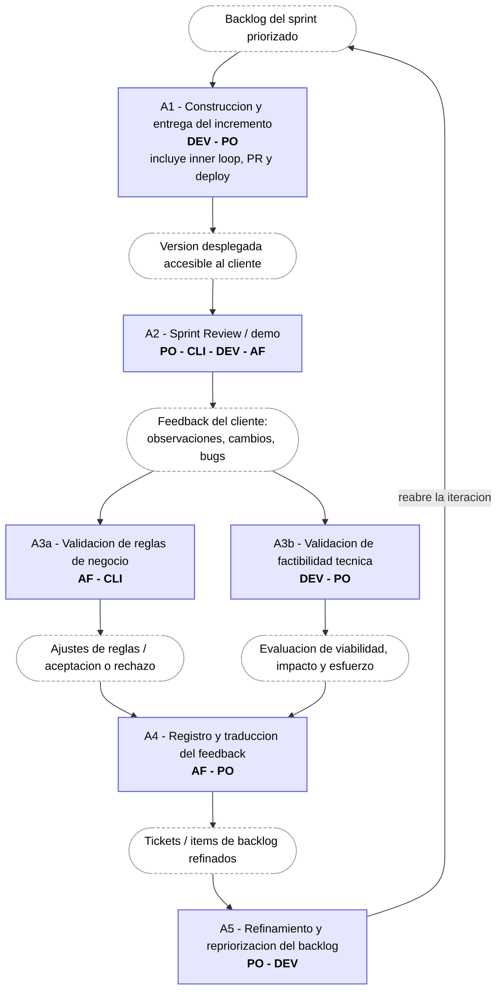
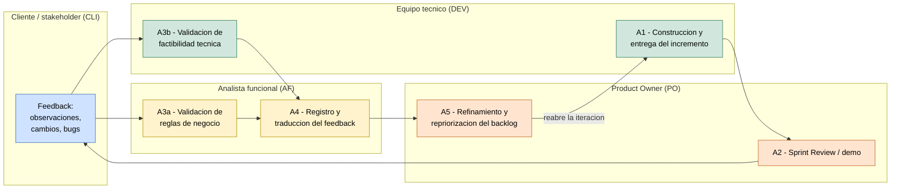

# Marco del proceso de desarrollo — zoom en la etapa de feedback

Zoom sobre la etapa de feedback del ciclo de vida (`sprint 12/CICLO_DE_VIDA.md`), la que ya habíamos acordado enfocar: la que ocurre una vez que existe una versión ≥ 0.1 con código entregada al cliente.

> El proceso **hoy** (§1–§3) y la **capa con IAG** (§4): ideas por actividad y grandes áreas, apoyadas en los papers relevados en el sprint 13.

---

## 1. Delimitación del zoom

**Entra:** desde que hay un incremento (v ≥ 0.1 **con código**) frente al negocio, y el feedback externo que desencadena hasta el siguiente entregable.

**Queda fuera:** discovery/elicitación inicial, validación de prototipo, diseño UX temprano, y el uso en producción / evolución (feedback posterior a la aceptación).

---

## 2. La etapa de feedback como modelo de proceso (instancia en Scrum)

> **A#** = actividad de esta etapa. La construcción del incremento (A1) va como *contexto*: es lo que produce la versión que ve el cliente, no es el foco.

| # | Actividad | Roles | Entradas | Salidas | Objetivo |
|---|---|---|---|---|---|
| A1 | Construcción y entrega del incremento *(contexto; incluye inner loop, revisión de PR y deploy)* | 🟩 DEV, 🟧 PO | Backlog del sprint, criterios de aceptación | Versión desplegada accesible al cliente | Producir y publicar el incremento para mostrarlo al negocio |
| A2 | Sprint Review / demo | 🟧 PO, 🟦 CLI, 🟩 DEV, 🟨 AF | Versión desplegada, sprint goal | Feedback del cliente (observaciones, cambios, bugs) | Validar que el incremento cumple lo acordado |
| A3a | Validación de reglas de negocio | 🟨 AF ↔ 🟦 CLI | Feedback del cliente, reglas y flujos definidos | Discrepancias, ajustes, aceptación/rechazo | Confirmar que el pedido respeta la regla de negocio real |
| A3b | Validación de factibilidad técnica | 🟩 DEV (+ 🟧 PO) | Feedback del cliente, código / arquitectura actual, requisitos no funcionales | Evaluación de viabilidad, impacto y esfuerzo; alternativas | Confirmar que lo pedido es técnicamente viable y a qué costo |
| A4 | Registro y traducción del feedback | 🟨 AF, 🟧 PO | Feedback crudo (call, mail, bugs) | Tickets / ítems de backlog refinados | Convertir feedback disperso en trabajo accionable |
| A5 | Refinamiento y repriorización del backlog | 🟧 PO (+ 🟩 DEV) | Tickets nuevos + backlog | Backlog priorizado | Decidir qué entra en la próxima iteración → reabre A1 |

> Correspondencia con el ciclo de vida (sprint 12): A1 pliega los loops técnicos internos (inner loop del dev y revisión de PR); A2 es el loop de incremento; A3a es la validación de reglas de negocio. El uso en producción (evolución) queda **fuera** del zoom.

---

## 3. Diagrama (Mermaid)

Flujo de artefactos: las cajas con borde punteado son **entradas/salidas** y las cajas llenas son **actividades** con sus roles. La salida de una actividad es la entrada de la siguiente. Render en `MARCO_PROCESO_FEEDBACK.png` (misma carpeta).

### 3.1. Vista secundaria: por carriles (roles)

Misma etapa, organizada en un carril por rol para ver de un vistazo quién es dueño de cada actividad y cómo el trabajo salta entre roles (útil para el objetivo C). Vista **secundaria** (la principal es el flujo de artefactos del §3). Render en `MARCO_PROCESO_FEEDBACK_carriles.png`.

> Mermaid no dibuja carriles perfectos (AF y PO pueden compartir banda). Para la tesis conviene rehacerlo en draw.io usando este esquema como guion.

---

## 4. Capa con IAG (ticket 2)

Por cada actividad (tomada del diagrama del §3), las soluciones con IAG que podríamos aplicar. Algunas etapas agrupan más de una actividad (p. ej. la validación). Entre paréntesis se indica la fuente: **producto** (relevado en los sprints 11/13) o **paper** (sprint 13). Lo que **no** cambia es el proceso ni los roles; cambia **quién** ejecuta la tarea y **cómo**.

#### A1 — Construcción y entrega del incremento

- Agentes que generan o ajustan el incremento a partir del ticket *(productos: Devin, Codegen)*.

#### A2 — Sprint Review / demo

- Stakeholder-IA impersonado que da feedback continuo sin esperar la ceremonia *(paper: "Designing Tiny Robots"; concepto del sprint 11)*.
- Asistente que resume la demo y detecta riesgos e impedimentos *(paper: "Meeting Assistants")*.

#### A3 — Validación del feedback *(cubre A3a reglas de negocio + A3b factibilidad técnica)*

- Chequear el pedido contra los requisitos/reglas ya definidos y detectar conflictos — *reglas de negocio* *(paper: "Integrating LLMs into RE")*.
- Detectar si el pedido ya está cubierto o implementado — *reglas de negocio* *(paper: "Closing the Loop US↔GUI")*.
- Estimar impacto y esfuerzo del pedido — *factibilidad técnica* *(poco cubierto → gap y foco de PoC)*.
- Detectar desalineación entre la intención y el sistema — *factibilidad técnica* *(paper: "Requirements are All You Need")*.

#### A4 — Registro y traducción del feedback *(mayor entrada de IAG)*

- Voz o call → tickets / user stories con criterios de aceptación *(productos: PM Agent, Versive, Kraftful; paper: "Towards Human-AI Synergy")*.
- Reportes de bug en lenguaje natural → bug completo con pasos de reproducción *(paper: "Bug Tracking GenAI")*.
- Reformular o mejorar la expresión del feedback del stakeholder *(paper: "Supporting Stakeholder Requirements Expression")*.

#### A5 — Refinamiento y repriorización del backlog

- Evaluar la calidad de los ítems del backlog y recomendar mejoras *(paper: "Epic Evaluator")*.
- Detectar riesgos de sobrecompromiso / readiness al priorizar *(paper: "Meeting Assistants")*.

---

## 5. Grandes áreas con IAG (mapa conceptual — ticket 3)

Las ideas por actividad (§4) se agrupan en cuatro áreas transversales que atraviesan varias actividades del loop. Cada una se describe por: **qué es**, **evidencia** (papers del sprint 13 y productos relevados) y **cómo cambia el rol** (quién lo hacía antes → quién lo hace con IA).

### 5.1. Impersonación de stakeholders (stakeholder-IA)

- **Qué es:** una IA configurada para representar a un stakeholder (cliente, usuario, PM) y emitir feedback como si fuera él, de forma continua y sin depender de su disponibilidad.
- **Evidencia:** *(paper: "Designing Tiny Robots"* — dinámicas participativas con stakeholders*)*; concepto de *AI-Stakeholder* (Pirozzi, corpus sprint 3); impersonación / personas virtuales del sprint 11.
- **Cómo cambia el rol:** el rol del cliente (🟦 CLI) como emisor de feedback pasa parcialmente a una IA; el humano queda como validador.
- **Límite (obj. D / ética):** *(paper: "REConnect")* advierte que la IA no debe sustituir la conexión humana ni descontextualizar; el stakeholder real sigue como curador y guardián de valores.

### 5.2. Oralidad / entrevistas → artefacto procesable

- **Qué es:** convertir feedback oral o conversacional (calls, entrevistas, demos) en artefactos estructurados y accionables (tickets, user stories con criterios, especificaciones, modelos de proceso).
- **Evidencia:** *(productos: PM Agent, Versive, Kraftful)*; *(papers: "Towards Human-AI Synergy in RE", "Automating BI Requirements", "Business Process Discovery through Agentic GenAI", "LLM-Assisted Sketch-Based Elicitation")*. Es el patrón central del sprint 13: *feedback humano → estructuración con IA → artefacto usable*.
- **Cómo cambia el rol:** la traducción que hacía el analista funcional (🟨 AF, actividad A4) pasa a ser asistida o realizada por IA; el AF cura y valida.
- **Límite:** precisión en extracción, jerarquías y modelado estructurado; riesgo de alucinaciones (varios SLR del sprint 13).

### 5.3. Chequeo de consistencia feedback ↔ requisitos (el "firewall")

- **Qué es:** validar automáticamente el pedido/feedback contra los requisitos, reglas y artefactos ya existentes; detectar conflictos, contradicciones, duplicados o cosas ya cubiertas, antes de que entre al backlog.
- **Evidencia:** *(papers: "Epic Evaluator"* — rúbrica de calidad de epics*; "Closing the Loop US↔GUI"* — detecta si ya está implementado y vincula requisito↔componente*; "Integrating LLMs into RE"* — inconsistencias y jerarquías*)*.
- **Cómo cambia el rol:** la validación de reglas de negocio (🟨 AF ↔ 🟦 CLI, actividad A3a) se apoya en una IA que pre-chequea consistencia; el AF resuelve lo que la IA marca.

### 5.4. Generación → desarrollo automático de tickets

- **Qué es:** del ticket —o incluso del requisito en lenguaje natural— al código integrado, de forma automática; agentes que toman trabajo planificado y lo implementan.
- **Evidencia:** *(productos: Devin, Codegen)*; *(paper: "Requirements are All You Need"* — requisitos → software + tests + mantenimiento*)*. **Contra-evidencia útil:** el pivote de Tusk y Sweep (abandonaron el ticket→PR autónomo) muestra que el modo totalmente autónomo todavía no cierra.
- **Cómo cambia el rol:** la construcción (🟩 DEV, actividad A1) pasa a agentes; el DEV supervisa, aunque la contra-evidencia (pivote de Tusk/Sweep) sugiere que hoy sigue requiriendo humano en el loop.

### 5.5. Transformación de roles: los 4 escenarios (marco de Daniel — a validar)

Las cuatro áreas de arriba muestran un mismo movimiento de fondo: actividades que hoy hace una persona empiezan a ser **suplantadas** por la IA. El paper que recomendó Daniel, *Future of software development with GenAI* (ver `PROPUESTA_DANIEL.md`), da una escala para graduar ese movimiento:

- **S1 — Tradicional:** humanos en todos los roles (= el proceso "hoy", §2).
- **S2 — AI in loop:** la IA automatiza tareas puntuales; el humano domina.
- **S3 — AI assumes roles:** la IA asume roles seleccionados; el humano supervisa.
- **S4 — Human-in-the-loop:** la IA en la mayoría de los roles; el humano vigila.

Leídas con esta escala, las áreas se ubican así: la **impersonación** (5.1) implica que la IA *asume* el rol del cliente (S3); la **oralidad→artefacto** (5.2) y el **firewall** (5.3) hoy son asistencia con supervisión humana (S2 tendiendo a S3); la **generación→desarrollo** (5.4) apunta a S3–S4.
