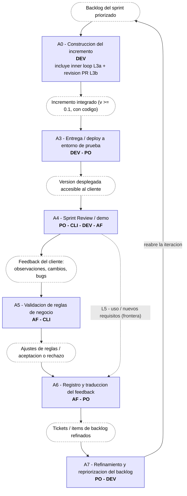

# Marco del proceso de desarrollo (sin IAG) — zoom en la etapa de feedback

Zoom sobre la etapa de feedback del ciclo de vida (`sprint 12/CICLO_DE_VIDA.md`), la que ya habíamos acordado enfocar: la que ocurre una vez que existe una versión ≥ 0.1 con código entregada al cliente.

---

## 1. Delimitación del zoom

**Entra:** desde que hay un incremento (v ≥ 0.1 **con código**) frente al negocio, y el feedback externo que desencadena hasta el siguiente entregable. Cubre **L3, L3a, L3b, L4**; toca la frontera con **L5**.

**Queda fuera:** discovery/elicitación inicial (L1), validación de prototipo (L2), diseño UX temprano, mantenimiento de largo plazo.

---

## 2. La etapa de feedback como modelo de proceso (instancia en Scrum)

| # | Actividad | Roles | Entradas | Salidas | Objetivo |
|---|---|---|---|---|---|
| A0 | Construcción del incremento *(contexto)* | 🟩 DEV | Backlog del sprint, criterios de aceptación | Incremento potencialmente entregable | Materializar en código lo comprometido |
| A1 | Inner loop del dev *(L3a)* | 🟩 DEV | Código en progreso, tests locales | Código que compila y pasa tests | Feedback técnico inmediato |
| A2 | Revisión técnica / PR *(L3b)* | 🟩 DEV ↔ 🟩 DEV | Cambio, criterios de diseño | Cambio aprobado e integrado | Calidad técnica antes de mostrar al negocio |
| A3 | Entrega / deploy a entorno de prueba | 🟩 DEV, 🟧 PO | Incremento integrado | Versión accesible al cliente | Poner el incremento frente al negocio |
| A4 | Sprint Review / demo *(L3)* | 🟧 PO, 🟦 CLI, 🟩 DEV, 🟨 AF | Incremento desplegado, sprint goal | Feedback del cliente (observaciones, cambios, bugs) | Validar que el incremento cumple lo acordado |
| A5 | Validación de reglas de negocio *(L4)* | 🟨 AF ↔ 🟦 CLI | Incremento, reglas y flujos definidos | Discrepancias, ajustes, aceptación/rechazo | Confirmar que refleja la regla de negocio real |
| A6 | Registro y traducción del feedback | 🟨 AF, 🟧 PO | Feedback crudo (call, mail, bugs) | Tickets / ítems de backlog refinados | Convertir feedback disperso en trabajo accionable |
| A7 | Refinamiento y repriorización del backlog | 🟧 PO (+ 🟩 DEV) | Tickets nuevos + backlog | Backlog priorizado | Decidir qué entra en la próxima iteración → reabre A0 |

Frontera con **L5 (evolución)**: con el incremento en uso, el monitoreo de ⬜ USR genera nuevos requisitos que también alimentan A6/A7. Señalado como frontera, no se desarrolla acá.

---

## 3. Diagrama (Mermaid)

Flujo de artefactos: las cajas con borde punteado son **entradas/salidas** (artefactos) y las cajas llenas son **actividades** con sus roles. La salida de una actividad es la entrada de la siguiente. Render en `MARCO_PROCESO_FEEDBACK.png` (misma carpeta).

---

## 4. Decisiones abiertas

- [ ] ¿L5 dentro del zoom o solo como frontera?
- [ ] Granularidad de A6: probable punto de mayor entrada de IAG en el ticket 2.
- [ ] ¿El diagrama se organiza en **carriles por rol** (un carril para CLI, otro para AF, otro para DEV…) para ver de un vistazo quién hace cada actividad? Útil para el objetivo C (transformación de roles con IAG).

---

## 5. Fuentes

> No van a `REFERENCIAS.bib` (corpus sistemático); citas clásicas gestionadas por fuera.

| Cita | Para qué | Link |
|---|---|---|
| Pressman & Maxim (2020), *Software Engineering: A Practitioner's Approach*, 9.ª ed., McGraw-Hill. ISBN 9781259872976 | Marco de proceso genérico | [mheducation.com](https://www.mheducation.com/highered/product/software-engineering-a-practitioners-approach-pressman.html) |
| Sommerville (2016), *Software Engineering*, 10.ª ed., Pearson. ISBN 9780133943030 | Actividades fundamentales; validación y evolución | [pearson.com](https://www.pearson.com/en-us/subject-catalog/p/software-engineering/P200000003258/9780137503148) |
| Schwaber & Sutherland (2020), *The Scrum Guide* | Sprint, review, backlog, roles | [scrumguides.org (PDF)](https://scrumguides.org/docs/scrumguide/v2020/2020-Scrum-Guide-US.pdf) · [ES](https://scrumguides.org/docs/scrumguide/v2020/2020-Scrum-Guide-Spanish-Latin-South-American.pdf) |
| Dumas et al. (2018), *Fundamentals of Business Process Management*, 2.ª ed., Springer | Validación de reglas / flujos de negocio (L4) | [doi.org/10.1007/978-3-662-56509-4](https://doi.org/10.1007/978-3-662-56509-4) |

---

_Primera versión — sprint 14._
