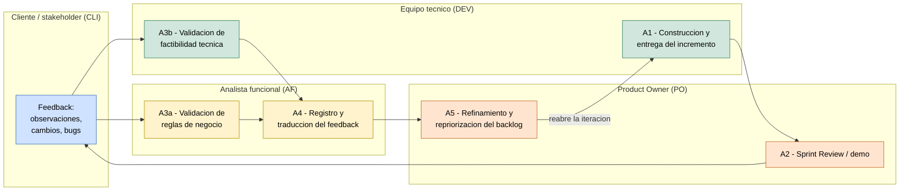

# Marco del proceso de desarrollo — zoom en la etapa de feedback

Zoom sobre la etapa de feedback del ciclo de vida (`sprint 12/CICLO_DE_VIDA.md`), la que ya habíamos acordado enfocar: la que ocurre una vez que existe una versión ≥ 0.1 con código entregada al cliente.

> El proceso **hoy** (§1–§3) y la **capa con IAG** (§4): ideas por actividad y grandes áreas, apoyadas en los papers relevados en el sprint 13.

---

## 1. Delimitación del zoom

**Entra:** desde que hay un incremento (v ≥ 0.1 **con código**) frente al negocio, y el feedback externo que desencadena hasta el siguiente entregable.

**Queda fuera:** discovery/elicitación inicial, validación de prototipo, diseño UX temprano, y el uso en producción / evolución (feedback posterior a la aceptación).

---

## 2. La etapa de feedback como modelo de proceso (instancia en Scrum)

> **A#** = actividad de esta etapa. La construcción del incremento (A1) va como *contexto*: es lo que produce la versión que ve el cliente, no es el foco.

| # | Actividad | Roles | Entradas | Salidas | Objetivo |
|---|---|---|---|---|---|
| A1 | Construcción y entrega del incremento *(contexto; incluye inner loop, revisión de PR y deploy)* | 🟩 DEV, 🟧 PO | Backlog del sprint, criterios de aceptación | Versión desplegada accesible al cliente | Producir y publicar el incremento para mostrarlo al negocio |
| A2 | Sprint Review / demo | 🟧 PO, 🟦 CLI, 🟩 DEV, 🟨 AF | Versión desplegada, sprint goal | Feedback del cliente (observaciones, cambios, bugs) | Validar que el incremento cumple lo acordado |
| A3a | Validación de reglas de negocio | 🟨 AF ↔ 🟦 CLI | Feedback del cliente, reglas y flujos definidos | Discrepancias, ajustes, aceptación/rechazo | Confirmar que el pedido respeta la regla de negocio real |
| A3b | Validación de factibilidad técnica | 🟩 DEV (+ 🟧 PO) | Feedback del cliente, código / arquitectura actual, requisitos no funcionales | Evaluación de viabilidad, impacto y esfuerzo; alternativas | Confirmar que lo pedido es técnicamente viable y a qué costo |
| A4 | Registro y traducción del feedback | 🟨 AF, 🟧 PO | Feedback crudo (call, mail, bugs) | Tickets / ítems de backlog refinados | Convertir feedback disperso en trabajo accionable |
| A5 | Refinamiento y repriorización del backlog | 🟧 PO (+ 🟩 DEV) | Tickets nuevos + backlog | Backlog priorizado | Decidir qué entra en la próxima iteración → reabre A1 |

> Correspondencia con el ciclo de vida (sprint 12): A1 pliega los loops técnicos internos (inner loop del dev y revisión de PR); A2 es el loop de incremento; A3a es la validación de reglas de negocio. El uso en producción (evolución) queda **fuera** del zoom.

---

## 3. Diagrama (Mermaid)

Flujo de artefactos: las cajas con borde punteado son **entradas/salidas** y las cajas llenas son **actividades** con sus roles. La salida de una actividad es la entrada de la siguiente. Render en `MARCO_PROCESO_FEEDBACK.png` (misma carpeta).

### 3.1. Vista secundaria: por carriles (roles)

Misma etapa, organizada en un carril por rol para ver de un vistazo quién es dueño de cada actividad y cómo el trabajo salta entre roles (útil para el objetivo C). Vista **secundaria** (la principal es el flujo de artefactos del §3). Render en `MARCO_PROCESO_FEEDBACK_carriles.png`.

> Mermaid no dibuja carriles perfectos (AF y PO pueden compartir banda). Para la tesis conviene rehacerlo en draw.io usando este esquema como guion.

---

## 4. Capa con IAG (ticket 2)

Por cada actividad (tomada del diagrama del §3), las soluciones con IAG que podríamos aplicar. Algunas etapas agrupan más de una actividad (p. ej. la validación). Referencias del sprint 13 entre paréntesis. Lo que **no** cambia es el proceso ni los roles; cambia **quién** ejecuta la tarea y **cómo**.

#### A1 — Construcción y entrega del incremento

- Agentes que generan o ajustan el incremento a partir del ticket *(Devin, Codegen)*.
- Generación automática de tests del PR y detección de regresiones *(Tusk)*.

#### A2 — Sprint Review / demo

- Stakeholder-IA impersonado que da feedback continuo sin esperar la ceremonia *("Designing Tiny Robots"; sprint 11)*.
- Asistente que resume la demo y detecta riesgos e impedimentos *("Meeting Assistants")*.

#### A3 — Validación del feedback *(cubre A3a reglas de negocio + A3b factibilidad técnica)*

- Chequear el pedido contra los requisitos/reglas ya definidos y detectar conflictos — *reglas de negocio* *("Integrating LLMs into RE")*.
- Detectar si el pedido ya está cubierto o implementado — *reglas de negocio* *("Closing the Loop US↔GUI")*.
- Estimar impacto y esfuerzo del pedido — *factibilidad técnica* *(poco cubierto → gap y foco de PoC)*.
- Detectar desalineación entre la intención y el sistema — *factibilidad técnica* *("Requirements are All You Need")*.

#### A4 — Registro y traducción del feedback *(mayor entrada de IAG)*

- Voz o call → tickets / user stories con criterios de aceptación *(PM Agent, Versive, Kraftful; "Towards Human-AI Synergy")*.
- Reportes de bug en lenguaje natural → bug completo con pasos de reproducción *("Bug Tracking GenAI")*.
- Reformular o mejorar la expresión del feedback del stakeholder *("Supporting Stakeholder Requirements Expression")*.

#### A5 — Refinamiento y repriorización del backlog

- Evaluar la calidad de los ítems del backlog y recomendar mejoras *("Epic Evaluator")*.
- Detectar riesgos de sobrecompromiso / readiness al priorizar *("Meeting Assistants")*.

---

## 5. Fuentes

> No van a `REFERENCIAS.bib` (corpus sistemático); citas clásicas gestionadas por fuera.

| Cita | Para qué | Link |
|---|---|---|
| Pressman & Maxim (2020), *Software Engineering: A Practitioner's Approach*, 9.ª ed., McGraw-Hill. ISBN 9781259872976 | Marco de proceso genérico | [mheducation.com](https://www.mheducation.com/highered/product/software-engineering-a-practitioners-approach-pressman.html) |
| Sommerville (2016), *Software Engineering*, 10.ª ed., Pearson. ISBN 9780133943030 | Actividades fundamentales; validación y evolución | [pearson.com](https://www.pearson.com/en-us/subject-catalog/p/software-engineering/P200000003258/9780137503148) |
| Schwaber & Sutherland (2020), *The Scrum Guide* | Sprint, review, backlog, roles | [scrumguides.org (PDF)](https://scrumguides.org/docs/scrumguide/v2020/2020-Scrum-Guide-US.pdf) · [ES](https://scrumguides.org/docs/scrumguide/v2020/2020-Scrum-Guide-Spanish-Latin-South-American.pdf) |
| Dumas et al. (2018), *Fundamentals of Business Process Management*, 2.ª ed., Springer | Validación de reglas / flujos de negocio | [doi.org/10.1007/978-3-662-56509-4](https://doi.org/10.1007/978-3-662-56509-4) |

---

_Primera versión — sprint 14._
