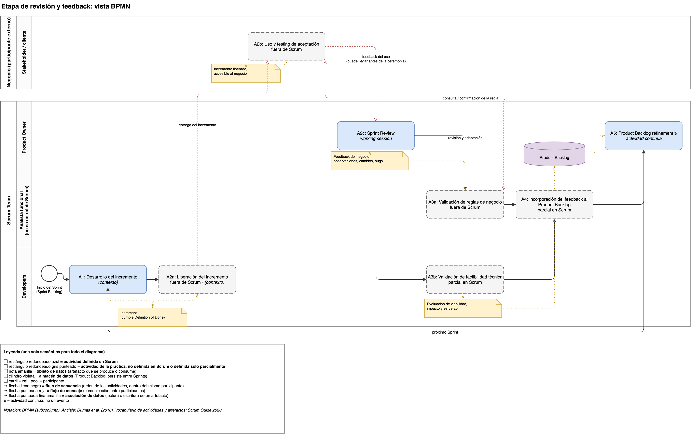
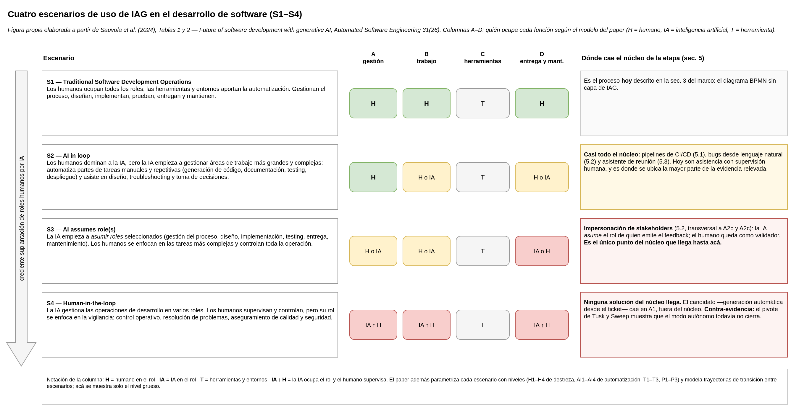

# Qué cambió desde la v1 — para la segunda pasada con Daniel

> Resumen para arrancar la reunión. Cada sección responde a un comentario de la call del 9 de julio y apunta al
> documento donde está el detalle.

## Mapa de documentos

El marco de trabajo pasa a ser el **v2**. La v1 no se editó: queda como registro del sprint 14.

| Documento | Qué es |
|---|---|
| `MARCO_PROCESO_FEEDBACK_v2.md` | **Reemplaza** al marco del sprint 14. Autocontenido: incluye la base normativa de Scrum, el modelo, el diagrama y la capa IAG |
| `FUENTES_MARCO.md` / `.bib` | **Nuevo.** Las fuentes con sus secciones verificadas (sec. a.1 Dumas, sec. a.2 Sommerville) |
| `diagramas/` | **Reemplazan** a los dos PNG del sprint 14: el marco en BPMN y la figura de escenarios |

---

## 1. Anclaje en bibliografía *(pedido: "falta fuente oficial")*

Se trabajó sobre la **Scrum Guide 2020**, con todas las citas verificadas literalmente contra el PDF oficial.

Son **dos documentos distintos**, no una fuente que se desdiga: la **página introductoria de scrum.org** resume el
framework y al resumir omite matices —de ahí la impresión de una reunión de aprobación—, mientras que la **Guía** es
explícita en que la review es una *working session* que no debe limitarse a una presentación y en que **nunca** debe
considerarse una puerta para liberar valor. La Guía además declara su propia incompletitud
(*"purposefully incomplete"*), y `feedback`, `test` y `acceptance` no aparecen ni una vez en sus 14 páginas.

→ Citas textuales, conteo léxico completo y alcance de lo verificado: **`MARCO_PROCESO_FEEDBACK_v2.md` sec. 2**.

**Consecuencia:** lo que Scrum no define no se presenta como si fuera Scrum. Se declara y se ancla en literatura de
ingeniería (Sommerville, Dumas), con secciones verificadas contra los ejemplares — ver `FUENTES_MARCO.md`. En el
diagrama, esas actividades van en gris punteado con ⚠.

## 2. Rascar la Sprint Review *(pedido: "hay toda una etapa de revisión")*

El zoom ya no es la ceremonia sola: es una **etapa de feedback** de tres momentos, y solo el último —la Sprint
Review— está definido por Scrum.

| | Actividad | ¿Scrum? | Origen |
|---|---|---|---|
| **A2a** | Liberación del incremento | ⚠ no | **Se hizo explícita:** en la v1 el deploy estaba escondido dentro de A1 |
| **A2b** | Uso y testing de aceptación | ⚠ no | **Nueva.** Es la pieza que faltaba |
| **A2c** | Sprint Review | ✅ sí | **Es la vieja A2**, sin la palabra "demo" |

El resto de las actividades: **A1** pasa a llamarse solo *Desarrollo del incremento* —la entrega se fue a A2a—,
**A3a** y **A3b** se mantienen igual (ahora marcadas ⚠ porque no son de Scrum), y **A4** y **A5** toman nombre de la
Guía: *Incorporación del feedback al Product Backlog* y *Product Backlog refinement*, esta última una actividad
**continua** y no un evento.

**Efecto teórico, no cosmético:** el feedback pasa a tener **dos canales y dos momentos** —el uso real del producto,
que puede llegar antes de la ceremonia, y la ceremonia misma—, materia directa del objetivo B. En el diagrama, la
entrega al negocio cruza al otro *pool* como flujo de mensaje sin pasar por la review, y del uso real sale un segundo
flujo rotulado *"puede llegar antes de la ceremonia"*.

**No se apoya solo en la lectura de Scrum:** Sommerville (2016) describe el par liberación + uso (sec. 2.3.2), el
*release* y el *acceptance testing* (sec. 8.3 y sec. 8.4), y sostiene que en ágil la aceptación no depende de una
especificación completa sino de stakeholders involucrados **con autoridad para decidir** (sec. 20.5) — la relación misma
que la tesis pone en cuestión cuando entra IAG. Citas en `FUENTES_MARCO.md` sec. a.2.

## 3. Notación uniforme *(pedido: "cajitas y globitos, marea un poquito")*

Se pasó a **BPMN**: como los roles son carriles del mismo diagrama, las dos vistas se unifican en **una sola** y no
quedan notaciones que reconciliar. El feedback, que antes era una caja de actividad, ahora es un objeto de datos.

## 4. Capa IAG reforzada *(pedido: "reforzar con los 4 artículos")*

Los cuatro artículos están verificados uno por uno y leídos. Qué respaldo tenía cada actividad antes y qué se agregó:

| Actividad | Antes | Se agregó |
|---|---|---|
| A1 Desarrollo | Solo dos **productos** (Devin, Codegen) | Malladi: la implementación es donde más se aplica IAG; generación de tests con TDD/BDD. Cornide-Reyes: código y debugging entre las fases más beneficiadas |
| **A2a** Liberación | **Nada: la actividad no existía** | Malladi: pipelines y CI/CD. Nguyen-Duc: automatizar *build* y *deployment* sigue siendo pregunta abierta |
| **A2b** Uso y aceptación | **Nada: la actividad no existía** | Nguyen-Duc: el *acceptance testing* **no es foco de los estudios existentes** (gap declarado) y la RQ abierta sobre automatizar criterios de aceptación. Cornide-Reyes: el riesgo de validar rápido sacrificando UX |
| A2c Sprint Review | Dos papers del corpus | Nguyen-Duc: plataformas humano-IA en tiempo real con *"instantaneous feedback loops"* → respalda el objetivo B |
| A3a Reglas de negocio | Dos papers del corpus | Nguyen-Duc: **el límite** — los LLM detectan inconsistencias, pero pueden desviar el proyecto sin revisión de stakeholders con experiencia |
| A3b Factibilidad | Marcada como *"poco cubierto → gap"* | Malladi: estimación y repriorización más consistentes, con menos sesgo humano → **corrige la v1**: ya no es gap |
| A4 Incorporación al backlog | Tres productos + tres papers | Malladi: user stories y *backlog grooming* asistidos. Cornide-Reyes: la planificación entre las fases más beneficiadas |
| A5 Refinement | Dos papers del corpus | Malladi: repriorización dinámica del backlog |

Cada ítem quedó etiquetado como **corpus**, **producto** o **general** (los cuatro artículos) para poder auditarlo
→ `MARCO_PROCESO_FEEDBACK_v2.md` sec. 5.

Dos cosas para decir de frente:

- **Ninguno de los cuatro menciona la Sprint Review.** Trabajan a nivel de etapas del SDLC, no de ceremonias:
  aportan la capa general, y el zoom fino sigue apoyado en el corpus. Mejor decirlo que sobrevender el anclaje.
- **El gap se movió:** salió de A3b (estimación, que resultó cubierta) y quedó en **A2b**, que además es la actividad
  más pegada al feedback.

## 5. Los cuatro escenarios S1–S4 *(pedido: "la imagen de los cuatro escenarios")*

**Qué son.** Cuatro escenarios de cómo se reorganiza el desarrollo según cuánto asume la IA (Sauvola et al., 2024).
No son etapas ni una predicción temporal: son una **escala de suplantación de roles humanos**, y el paper modela en
cada uno quién ocupa cuatro funciones (gestión, trabajo, herramientas, entrega y mantenimiento).

| | Escenario | Quién hace qué | Áreas del marco |
|---|---|---|---|
| **S1** | *Traditional* | Humanos en todos los roles | El proceso **hoy** |
| **S2** | *AI in loop* | El humano domina; la IA automatiza tareas repetitivas y asiste decisiones | Oralidad → artefacto · chequeo de consistencia |
| **S3** | *AI assumes role(s)* | La IA **asume roles** seleccionados; el humano controla la operación | Impersonación de stakeholders |
| **S4** | *Human-in-the-loop* | La IA gestiona varios roles; el humano pasa a vigilancia | Generación → desarrollo automático (con el pivote de Tusk/Sweep como contra-evidencia) |

**Para qué sirve:** es la escala que le faltaba al **objetivo C** — permite decir *cuánto* asume la IA en cada área
en lugar de solo afirmar que "cambia el rol". La figura es **propia**, redibujada a partir de las Tablas 1 y 2 del
paper.

## 6. Lo que no se tocó

El **punto 5 (grandes áreas)** quedó como estaba, según lo pedido; solo se actualizaron los nombres de actividades.
El marco v1 tampoco se editó.

---

## Decisiones a confirmar en la reunión

1. **¿Va el desdoblamiento de A2?** Es la lectura literal del reparo y tiene respaldo en Sommerville, pero suma dos
   cajas al diagrama.
2. **¿Se mantiene el analista funcional**, sabiendo que no existe en Scrum? (Propuesta: sí, declarado como rol de la
   práctica y anclado en que el PO *"may delegate the responsibility to others"*. Es el intermediario del objetivo C.)
3. **¿El Scrum Master queda afuera** del diagrama? (Propuesta: sí, con la ausencia declarada.)
4. **¿Cuánto peso darle al hallazgo léxico** (`feedback` = 0 en la Guía)? Sirve para justificar el marco como aporte
   propio y no como copia de Scrum; podría ir en el cuerpo de la tesis.

## Siguiente paso propuesto

Elegir **una** de las cuatro grandes áreas para bajar a la PoC. **A2b** (criterios y testing de aceptación asistidos)
quedó como candidata con respaldo explícito —el gap declarado de Nguyen-Duc et al. y sec. 20.5 de Sommerville— y está más
pegada al feedback que la generación de tickets → código.
