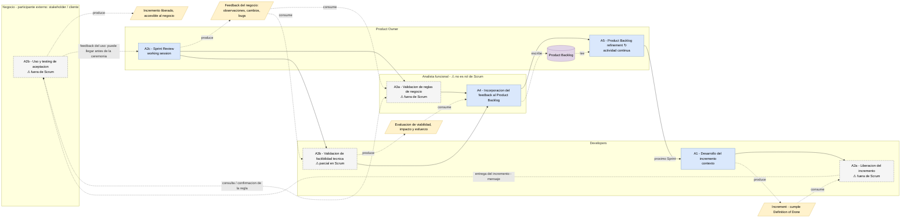

# Marco del proceso de desarrollo — zoom en la etapa de feedback (v2)

> **v2 del sprint 15.** La v1 está en `sprint 14/MARCO_PROCESO_FEEDBACK.md` (se conserva como registro).
> Cambios de esta versión respecto de la v1:
> 1. Actividades **ancladas y renombradas** según la Scrum Guide 2020 → fundamento en `SCRUM_ANCLAJE.md`.
> 2. **A2 se desdobla** en liberación / uso y testing de aceptación / Sprint Review.
> 3. Diagrama **formalizado en BPMN**, con una sola semántica y leyenda explícita, en `diagramas/marco_feedback_bpmn.drawio`.
> 4. Lo que **no** está definido en Scrum queda marcado como tal (⚠), con su anclaje propio.
>
> §4 y §5 (capa IAG y grandes áreas) se reescriben en la **Fase 3** del sprint, incorporando los 4 artículos del tutor.

---

## 1. Delimitación del zoom

**Entra:** desde que hay un incremento (v ≥ 0.1 **con código**) que llega al negocio, y el feedback externo
que desencadena hasta el siguiente entregable.

**Queda fuera:** discovery / elicitación inicial, validación de prototipo, diseño UX temprano, y el uso en
producción / evolución (feedback posterior a la aceptación).

### 1.1. Por qué el zoom no es solo la Sprint Review

Es la corrección central de esta versión. La Sprint Review **es** el momento que Scrum define para inspeccionar
el incremento con los stakeholders, pero la Guía 2020:

- la define como *working session* y advierte que **no debe limitarse a una presentación**;
- **desacopla la liberación de la ceremonia**: *"an Increment may be delivered to stakeholders prior to the end
  of the Sprint. The Sprint Review should never be considered a gate to releasing value"*;
- **declara su propia incompletitud**: *"The Scrum framework is purposefully incomplete, only defining the parts
  required to implement Scrum theory"*, y se define como *"container for other techniques, methodologies, and practices"*.

Y no menciona nunca las palabras `feedback`, `test` ni `acceptance` (0 ocurrencias en el texto completo).

Conclusión para el marco: la etapa que estudiamos es una **etapa de revisión** compuesta por liberación → uso y
testing de aceptación → Sprint Review, de la cual **solo el último momento está definido por Scrum**. Los otros dos
se anclan en literatura de ingeniería de software. Ver `SCRUM_ANCLAJE.md` §4 y §5.

> **Precisión sobre las fuentes de Scrum.** Todo lo anterior sale de la **Scrum Guide 2020**, el documento
> normativo. No debe confundirse con el **material introductorio de scrum.org**, que resume el framework y, al
> resumir, omite estos matices: de ahí la lectura habitual de la Sprint Review como una reunión de aprobación.
> No son fuentes que se contradigan — una resume a la otra. Alcance de lo verificado en `SCRUM_ANCLAJE.md` §3.1.

---

## 2. La etapa de feedback como modelo de proceso

> **A#** = actividad de esta etapa. **⚠** = actividad de la práctica **no definida en Scrum** (con su anclaje propio).
> A1 va como *contexto*: es lo que produce la versión que ve el negocio, no es el foco.

| # | Actividad | Roles | Entradas | Salidas | Objetivo | Anclaje |
|---|---|---|---|---|---|---|
| A1 | Desarrollo del incremento *(contexto; incluye inner loop y revisión de PR)* | Developers, PO | Sprint Backlog, Definition of Done | *Increment* que cumple la DoD | Producir el incremento | Scrum: *Sprint*, *Increment*, *DoD* · el **cómo** no lo define Scrum → Sommerville (2016) §7.3; Pressman & Maxim (2020) |
| A2a | **Liberación del incremento** ⚠ | Developers | Increment | Incremento liberado, accesible al negocio | Poner el incremento en manos del negocio | Fuera de Scrum (*"never a gate to releasing value"*) → Sommerville (2016) §2.3.2 (el incremento se *instala en el entorno de trabajo del cliente*) y §8.3 *release testing*; Humble & Farley (2010) |
| A2b | **Uso y testing de aceptación** ⚠ | Stakeholder (+ AF) | Incremento liberado, criterios de aceptación | Observaciones, cambios, bugs detectados en el uso | Que el negocio use el producto y detecte desvíos | Fuera de Scrum (`acceptance`: 0 ocurrencias) → Sommerville (2016) §8.4 *user / acceptance testing* (seis etapas, la primera define los criterios) y §20.5 (en ágil la aceptación la deciden stakeholders involucrados, sin especificación completa) |
| A2c | **Sprint Review** | PO, Developers, Stakeholders, AF | Suma de incrementos, Product Goal | Feedback del negocio; Product Backlog ajustado | Inspeccionar el resultado del Sprint y determinar adaptaciones | Scrum Guide (2020), p. 9 — *working session*, ≤ 4 h para un Sprint de un mes |
| A3a | Validación de reglas de negocio ⚠ | AF ↔ Stakeholder | Feedback, reglas y flujos definidos | Discrepancias, ajustes, aceptación/rechazo | Confirmar que el pedido respeta la regla de negocio real | Fuera de Scrum → Dumas et al. (2018) §4.4 (reglas de negocio en el modelo) y §5.4.2 (la validación *"can only be done by talking to the process participants"*); Sommerville (2016) §4.5, chequeos de validez, consistencia, completitud y realismo |
| A3b | Validación de factibilidad técnica ⚠ *(parcial)* | Developers (+ PO) | Feedback, código/arquitectura, requisitos no funcionales | Evaluación de viabilidad, impacto y esfuerzo; alternativas | Confirmar que lo pedido es viable y a qué costo | Parcial en Scrum (Developers *"creating a plan"*; PO y *trade-offs*) → Sommerville (2016) §25.3, flujo de *change request* con análisis de costo/impacto |
| A4 | **Incorporación del feedback al Product Backlog** | AF, PO | Feedback crudo (call, mail, bugs) | Ítems de Product Backlog | Convertir feedback disperso en trabajo accionable | Scrum Guide (2020), p. 6: *"Those wanting to change the Product Backlog can do so by trying to convince the Product Owner"* |
| A5 | **Product Backlog refinement** ↻ | PO (+ Developers) | Ítems nuevos + Product Backlog | Product Backlog ordenado y refinado | Decidir qué entra en la próxima iteración → reabre A1 | Scrum Guide (2020), p. 10 — término textual; *ordering* del PO, p. 5. **Actividad continua, no evento** |

### 2.1. Correspondencia con la v1 y con el ciclo de vida

| v1 (sprint 14) | v2 | Motivo del cambio |
|---|---|---|
| A1 Construcción y entrega del incremento | A1 Desarrollo del incremento + **A2a Liberación** | La entrega se separa: Scrum la desacopla de la ceremonia |
| A2 Sprint Review / **demo** | **A2b** Uso y testing de aceptación + **A2c** Sprint Review | Se cae "demo": la Guía dice que no debe limitarse a una presentación. Se agrega el uso/aceptación real, que era el reparo del tutor |
| A3a / A3b Validación | A3a / A3b (igual, marcadas ⚠) | Se mantienen; se explicita que no son de Scrum |
| A4 Registro y traducción del feedback | A4 Incorporación del feedback al Product Backlog | Nombre anclado en la Guía |
| A5 Refinamiento y repriorización del backlog | A5 Product Backlog refinement | Término textual de la Guía; se marca que es continua |

Respecto del ciclo de vida (`sprint 12/CICLO_DE_VIDA.md`): A1 pliega los loops técnicos internos (L3a inner loop,
L3b revisión de PR); A2a–A2c son el loop de incremento (L3); A3a es la validación de reglas de negocio (L4).
El uso en producción / evolución (L5) queda **fuera** del zoom.

### 2.2. Roles

| Rol | ¿Scrum? | Nota |
|---|---|---|
| **Product Owner** | ✅ accountability | — |
| **Developers** | ✅ accountability | Scrum no tiene rol de QA separado: el testing vive dentro de Developers vía Definition of Done |
| **Stakeholder / cliente** | ⚠ término de la Guía, pero **no** es accountability | Participante externo al Scrum Team |
| **Analista funcional (AF)** | ❌ no existe | Se mantiene, anclado en que el PO *"may delegate the responsibility to others"* + BABOK/RE. Es el intermediario cuya mediación la IAG pone en cuestión (objetivo C) |
| Scrum Master | ✅ accountability | **Ausente del marco a propósito**: no es dueño de ninguna actividad del loop de feedback |

---

## 3. Diagrama

**Fuente autoritativa:** `diagramas/marco_feedback_bpmn.drawio` (abrir en draw.io / app.diagrams.net y exportar PNG).
**Notación:** BPMN (subconjunto), anclada en Dumas et al. (2018) — **§3.4 Resources** para pools y carriles
(*"BPMN provides two constructs to model resource aspects: pools and lanes"*) y **§3.3 Business Objects** para los
objetos de datos (qué artefactos requiere y produce cada actividad). El vocabulario de actividades y artefactos
viene de la Scrum Guide 2020.

### 3.1. Leyenda (una sola semántica para todo el diagrama)

| Elemento | Significado |
|---|---|
| Rectángulo redondeado **azul** | Actividad **definida en Scrum** |
| Rectángulo redondeado **gris punteado** | Actividad de la práctica, **⚠ no definida en Scrum** |
| **Nota amarilla** | Objeto de datos (artefacto que se produce o consume) |
| **Cilindro violeta** | Almacén de datos (*Product Backlog*, persiste entre Sprints) |
| **Carril** / pool | Rol / participante |
| Flecha **llena negra** | Flujo de secuencia (orden de actividades dentro del mismo participante) |
| Flecha **punteada roja** | Flujo de mensaje (comunicación entre participantes) |
| Flecha **punteada fina amarilla** | Asociación de datos (lectura o escritura de un artefacto) |
| ↻ | Actividad continua, no un evento |

> Esto resuelve el reproche del sprint 14: en la v1 la vista principal usaba cajas **y** globos y la vista por
> carriles usaba solo cajas, con una de ellas (el feedback) que en realidad era un artefacto. Ahora **hay un solo
> diagrama**: los roles son carriles y el flujo es el mismo, así que no hay dos notaciones que reconciliar.

### 3.2. Vista de trabajo (Mermaid)

Réplica del BPMN para iterar rápido y para que se vea renderizada en GitHub. **No es la versión final**: la
autoritativa es el `.drawio`.

> Limitación conocida: Mermaid no distingue flujo de mensaje de asociación de datos con estilos de línea
> diferentes (ambos son punteados) ni dibuja carriles reales. Por eso la versión formal es el BPMN.

---

## 4. Capa con IAG

Por cada actividad del §2, las soluciones con IAG que podrían aplicarla. Lo que **no** cambia es el proceso ni los
roles; cambia **quién** ejecuta la tarea y **cómo**.

Cada ítem indica su fuente y de qué tipo es:

- **[general]** — uno de los **4 artículos del tutor** (`FUENTES_MARCO.md` §b): hablan del proceso de desarrollo
  en términos generales, por etapa del SDLC.
- **[corpus]** — paper del corpus del mapeo de literatura (`sprint 12/REFERENCIAS.md`): evidencia puntual.
- **[producto]** — producto o empresa relevada en el sprint 11: evidencia de mercado, no académica.

### 4.1. Por actividad

#### A1 — Desarrollo del incremento *(contexto)*

- La aplicación más extendida de IAG está justamente acá: copilotos que aceleran codificación, refactorización y
  reparación de bugs, ya con validación empírica **[general: Malladi & Sudheer Reddy, 2025]**.
- Generación automática de tests unitarios, integración con TDD/BDD y localización de defectos
  **[general: Malladi & Sudheer Reddy, 2025]**; casos de prueba autogenerados como una de las fases más
  beneficiadas **[general: Cornide-Reyes et al., 2025]**.
- Agentes que generan o ajustan el incremento a partir del ticket **[productos: Devin, Codegen]**.

#### A2a — Liberación del incremento ⚠

- Autoría de pipelines y prácticas de CI/CD con conciencia de calidad, combinando métodos híbridos
  **[general: Malladi & Sudheer Reddy, 2025]**.
- La automatización de los procesos de *build* y *deployment* sigue planteada como **pregunta de investigación
  abierta** (§4.6.2, área *Software Processes and Tools*) **[general: Nguyen-Duc et al., 2025]** → zona poco resuelta.

#### A2b — Uso y testing de aceptación ⚠

- **Gap declarado:** la agenda de investigación señala que el *acceptance testing* (junto con integración y
  atributos de calidad) **no es foco de los estudios existentes** y que hace falta investigación sobre la
  efectividad y los límites de la IAG ahí **[general: Nguyen-Duc et al., 2025]**.
- Pregunta abierta asociada: *"How can GenAI be utilized to automate acceptance criteria from high-level
  requirements?"* **[general: Nguyen-Duc et al., 2025]**.
- Reportes de bug en lenguaje natural → bug completo con pasos de reproducción **[corpus: Bug Tracking GenAI]**.
- **Límite:** usar IAG para validar rápido puede terminar sacrificando calidad de UX en favor de la velocidad de
  entrega **[general: Cornide-Reyes et al., 2025]**.

#### A2c — Sprint Review

- Stakeholder-IA impersonado que emite feedback de forma continua, sin esperar la ceremonia
  **[corpus: Designing Tiny Robots; concepto del sprint 11]**.
- Asistente que resume la reunión y detecta riesgos e impedimentos **[corpus: Meeting Assistants]**.
- A nivel general, se proyecta un modo de trabajo de plataformas colaborativas humano-IA que asisten a expertos de
  dominio, ingenieros de requisitos y usuarios **en tiempo real**, habilitando *"instantaneous feedback loops"* y
  refinamiento iterativo como nueva norma **[general: Nguyen-Duc et al., 2025]** → sostiene la hipótesis del
  objetivo B sobre frecuencia y temporalidad.

> ⚠️ **Ninguno de los 4 artículos del tutor menciona la Sprint Review** (0 ocurrencias de "sprint review" en los
> cuatro textos completos). Trabajan a nivel de etapas del SDLC, no de ceremonias. Por eso el zoom fino en la
> ceremonia sigue apoyado en el corpus, y los 4 artículos aportan la capa general.

#### A3a — Validación de reglas de negocio ⚠

- Chequear el pedido contra los requisitos y reglas ya definidos, detectando conflictos **[corpus: Integrating LLMs
  into RE]**; detectar si el pedido ya está cubierto o implementado **[corpus: Closing the Loop US↔GUI]**.
- A nivel general: los LLMs detectan requisitos superfluos, incorrectos o inconsistentes en un contexto de dominio,
  **pero** esas inconsistencias pueden desviar el proyecto si no son revisadas meticulosamente por stakeholders con
  experiencia **[general: Nguyen-Duc et al., 2025]** → el chequeo automático no reemplaza la validación humana.

#### A3b — Validación de factibilidad técnica ⚠

- Estimación de esfuerzo e impacto: técnicas automatizadas dan repriorización y estimación **más consistentes,
  reduciendo el sesgo humano** y mejorando la alineación con necesidades cambiantes del cliente
  **[general: Malladi & Sudheer Reddy, 2025]**.
- La generación de criterios de aceptación y descripciones de escenarios permite a POs y developers **tomar
  decisiones de trade-off informadas** durante los releases iterativos **[general: Malladi & Sudheer Reddy, 2025]**.
- Detectar desalineación entre la intención y el sistema **[corpus: Requirements are All You Need]**.

> **Corrección respecto de la v1:** la v1 marcaba "estimar impacto y esfuerzo" como *poco cubierto → gap y foco de
> PoC*. Con la capa general eso ya no se sostiene: hay evidencia de cobertura. El gap se corre a **A2b**
> (testing de aceptación), que sí está declarado como poco estudiado.

#### A4 — Incorporación del feedback al Product Backlog

- Voz o call → tickets / user stories con criterios de aceptación **[productos: PM Agent, Versive, Kraftful;
  corpus: Towards Human-AI Synergy]**.
- Reformular o mejorar la expresión del feedback del stakeholder **[corpus: Supporting Stakeholder Requirements
  Expression]**.
- A nivel general: los LLMs asisten en la redacción de user stories y en el *backlog grooming*, mejorando la
  precisión de estimación y planificación **[general: Malladi & Sudheer Reddy, 2025]**; la planificación (análisis
  de requisitos y generación de user stories) es una de las fases del ciclo ágil más beneficiadas
  **[general: Cornide-Reyes et al., 2025]**.

#### A5 — Product Backlog refinement ↻

- Evaluar la calidad de los ítems del backlog y recomendar mejoras **[corpus: Epic Evaluator]**; detectar riesgos de
  sobrecompromiso al priorizar **[corpus: Meeting Assistants]**.
- Repriorización dinámica del backlog como área en expansión **[general: Malladi & Sudheer Reddy, 2025]**.

### 4.2. Trazabilidad (actividad → afirmación → fuente)

Tabla para que el tutor pueda auditar cada afirmación contra su fuente.

| Actividad | Afirmación | Fuente | Tipo |
|---|---|---|---|
| A1 | La implementación es donde más se aplica IAG (código, refactor, bug repair) | Malladi & Sudheer Reddy (2025), §III | general |
| A1 | Generación de tests, TDD/BDD, localización de defectos | Malladi & Sudheer Reddy (2025), §III | general |
| A1 | Código y debugging automatizados como fase beneficiada | Cornide-Reyes et al. (2025), abstract y RQ3 | general |
| A1 | Agentes ticket → PR | Devin, Codegen | producto |
| A2a | CI/CD y autoría de pipelines con IAG | Malladi & Sudheer Reddy (2025), §III | general |
| A2a | Automatizar build y deployment sigue siendo RQ abierta | Nguyen-Duc et al. (2025), §4.6.2 *Software Processes and Tools* | general |
| A2b | El testing de aceptación **no** es foco de los estudios existentes | Nguyen-Duc et al. (2025), §4.4.5 *Quality Assurance* | general |
| A2b | RQ: automatizar criterios de aceptación desde requisitos de alto nivel | Nguyen-Duc et al. (2025), §4.4.2 *Quality Assurance* | general |
| A2b | Bug en lenguaje natural → bug con pasos de reproducción | Bug Tracking GenAI | corpus |
| A2b | Validar rápido con IAG puede degradar la UX | Cornide-Reyes et al. (2025), §1 | general |
| A2c | Stakeholder-IA que emite feedback continuo | Designing Tiny Robots | corpus |
| A2c | Asistente que resume y detecta riesgos e impedimentos | Meeting Assistants | corpus |
| A2c | Plataformas humano-IA con *instantaneous feedback loops* | Nguyen-Duc et al. (2025), área *RE* | general |
| A3a | Chequeo de conflictos contra requisitos y reglas | Integrating LLMs into RE | corpus |
| A3a | Detectar si el pedido ya está implementado | Closing the Loop US↔GUI | corpus |
| A3a | Los LLMs detectan inconsistencias, pero requieren revisión de stakeholders con experiencia | Nguyen-Duc et al. (2025), área *RE* | general |
| A3b | Estimación y repriorización más consistentes, menos sesgo humano | Malladi & Sudheer Reddy (2025), §V | general |
| A3b | Criterios de aceptación y escenarios habilitan trade-offs informados | Malladi & Sudheer Reddy (2025), §V | general |
| A3b | Detectar desalineación intención ↔ sistema | Requirements are All You Need | corpus |
| A4 | Voz/call → tickets con criterios de aceptación | PM Agent, Versive, Kraftful · Towards Human-AI Synergy | producto + corpus |
| A4 | Mejorar la expresión del feedback del stakeholder | Supporting Stakeholder Requirements Expression | corpus |
| A4 | Redacción de user stories y *backlog grooming* asistidos | Malladi & Sudheer Reddy (2025), §III y §V | general |
| A4 | Planificación y generación de user stories entre las fases más beneficiadas | Cornide-Reyes et al. (2025), RQ3 | general |
| A5 | Evaluar calidad de ítems del backlog | Epic Evaluator | corpus |
| A5 | Riesgo de sobrecompromiso al priorizar | Meeting Assistants | corpus |
| A5 | Repriorización dinámica del backlog | Malladi & Sudheer Reddy (2025), §III | general |

### 4.3. Qué aportan los 4 artículos del tutor (y qué no)

**Aportan:**

1. **La capa general que faltaba.** La v1 solo citaba el corpus del mapeo; ahora cada actividad tiene además
   respaldo a nivel de etapa del SDLC, que es lo que el tutor pidió para hacerlo trazable.
2. **Dos gaps declarados** que sirven para elegir el foco de la PoC: el testing de aceptación (poco estudiado) y la
   automatización de build/deployment (RQ abierta) — ambos de Nguyen-Duc et al. (2025).
3. **Una corrección** a la v1: la estimación de esfuerzo ya está cubierta, no es gap (§4.1, A3b).
4. **Dos marcos de encuadre:** los escenarios S1–S4 de Sauvola et al. (2024) para graduar la suplantación de roles
   (§5.5), y las **11 áreas** de Nguyen-Duc et al. (2025) para ubicar el zoom: nuestro zoom cae principalmente en
   *Requirements Engineering*, *Quality Assurance* y *Engineering Management*.

**No aportan:** nada sobre la **Sprint Review** ni sobre las ceremonias en particular (0 ocurrencias en los cuatro).
El zoom fino en el momento del feedback sigue sostenido por el corpus del mapeo. Es una división de trabajo
razonable entre las dos capas, pero conviene decirlo explícitamente para no sobrevender el anclaje.

---

## 5. Grandes áreas con IAG

> **Aprobado por el tutor tal cual** en la call del 9 de jul (*"me gusta como lo hiciste, no cambies"*). Se
> conserva el contenido de la v1 (`sprint 14/MARCO_PROCESO_FEEDBACK.md` §5), con los nombres de actividades
> actualizados al §2 de este documento y la figura propia de los escenarios.

Las ideas por actividad (§4) se agrupan en cuatro áreas transversales. Cada una se describe por **qué es**,
**evidencia** y **cómo cambia el rol**.

### 5.1. Impersonación de stakeholders (stakeholder-IA)

- **Qué es:** una IA configurada para representar a un stakeholder (cliente, usuario, PM) y emitir feedback como si
  fuera él, de forma continua y sin depender de su disponibilidad.
- **Evidencia:** *(corpus: Designing Tiny Robots* — dinámicas participativas con stakeholders*)*; concepto de
  *AI-Stakeholder* (Pirozzi, sprint 3); impersonación / personas virtuales del sprint 11.
- **Cómo cambia el rol:** el rol del stakeholder como emisor de feedback pasa parcialmente a una IA (actividad
  **A2c**, y potencialmente **A2b**); el humano queda como validador.
- **Límite (obj. D / ética):** *(corpus: REConnect)* advierte que la IA no debe sustituir la conexión humana ni
  descontextualizar; el stakeholder real sigue como curador y guardián de valores.

### 5.2. Oralidad / entrevistas → artefacto procesable

- **Qué es:** convertir feedback oral o conversacional (calls, entrevistas, demos) en artefactos estructurados y
  accionables (tickets, user stories con criterios, especificaciones, modelos de proceso).
- **Evidencia:** *(productos: PM Agent, Versive, Kraftful)*; *(corpus: Towards Human-AI Synergy in RE, Automating
  BI Requirements, Business Process Discovery through Agentic GenAI, LLM-Assisted Sketch-Based Elicitation)*;
  *(general: Malladi & Sudheer Reddy, 2025* — user stories y backlog grooming asistidos*)*. Es el patrón central
  del sprint 13: *feedback humano → estructuración con IA → artefacto usable*.
- **Cómo cambia el rol:** la traducción que hacía el analista funcional (actividad **A4**) pasa a ser asistida o
  realizada por IA; el AF cura y valida.
- **Límite:** precisión en extracción, jerarquías y modelado estructurado; riesgo de alucinaciones.

### 5.3. Chequeo de consistencia feedback ↔ requisitos (el "firewall")

- **Qué es:** validar automáticamente el pedido contra los requisitos, reglas y artefactos existentes; detectar
  conflictos, contradicciones, duplicados o cosas ya cubiertas, antes de que entren al Product Backlog.
- **Evidencia:** *(corpus: Epic Evaluator* — rúbrica de calidad de epics*; Closing the Loop US↔GUI* — detecta si ya
  está implementado*; Integrating LLMs into RE* — inconsistencias y jerarquías*)*.
- **Cómo cambia el rol:** la validación de reglas de negocio (actividad **A3a**) se apoya en una IA que pre-chequea
  consistencia; el AF resuelve lo que la IA marca.
- **Límite:** *(general: Nguyen-Duc et al., 2025)* — las inconsistencias detectadas por LLMs pueden desviar el
  proyecto si no las revisan stakeholders con experiencia de dominio.

### 5.4. Generación → desarrollo automático de tickets

- **Qué es:** del ticket —o del requisito en lenguaje natural— al código integrado, de forma automática.
- **Evidencia:** *(productos: Devin, Codegen)*; *(corpus: Requirements are All You Need)*; *(general: Malladi &
  Sudheer Reddy, 2025* — la implementación es el área de mayor aplicación*)*. **Contra-evidencia útil:** el pivote
  de Tusk y Sweep (abandonaron el ticket→PR autónomo) muestra que el modo totalmente autónomo todavía no cierra.
- **Cómo cambia el rol:** la construcción (actividad **A1**) pasa a agentes; el DEV supervisa.

### 5.5. Transformación de roles: los cuatro escenarios S1–S4

Las cuatro áreas muestran un mismo movimiento de fondo: actividades que hoy hace una persona empiezan a ser
asumidas por la IA. Sauvola et al. (2024) dan una escala para graduar ese movimiento.

**Figura:** `diagramas/escenarios_s1_s4.drawio` — figura **propia** elaborada a partir de las Tablas 1 y 2 del
paper (se redibuja en vez de reproducir la imagen original, y se cita la fuente).

| Escenario | Nombre | En una línea | Dónde caen nuestras áreas |
|---|---|---|---|
| **S1** | *Traditional Software Development Operations* | Humanos en todos los roles; las herramientas automatizan | Es el proceso **hoy** (§2) |
| **S2** | *AI in loop* | El humano domina; la IA automatiza partes de tareas y asiste decisiones | **5.2** oralidad→artefacto y **5.3** firewall |
| **S3** | *AI assumes role(s)* | La IA asume roles seleccionados; el humano controla la operación | **5.1** impersonación (la IA *asume* el rol de quien da feedback) |
| **S4** | *Human-in-the-loop* | La IA gestiona varios roles; el humano vigila | **5.4** generación→desarrollo apunta acá (con la contra-evidencia de Tusk/Sweep) |

El paper además parametriza cada escenario (H1–H4 de destreza humana, AI1–AI4 de automatización, T1–T3 de
herramientas, P1–P3 de proceso) y modela **trayectorias de transición** entre escenarios. Para la tesis alcanza con
el nivel grueso, pero la parametrización es citable si hace falta precisión sobre "cuánto" asume la IA.

---

_Última actualización: 2026-07-26 — Fase 3 del sprint 15 (Fase 4 pendiente)._
