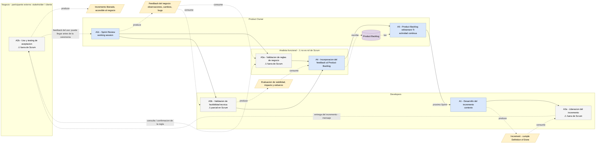

# Marco del proceso de desarrollo — zoom en la etapa de feedback (v2)

> **v2 del sprint 15.** La v1 está en `sprint 14/MARCO_PROCESO_FEEDBACK.md` (se conserva como registro).
> Cambios de esta versión respecto de la v1:
> 1. Actividades **ancladas y renombradas** según la Scrum Guide 2020 → fundamento en `SCRUM_ANCLAJE.md`.
> 2. **A2 se desdobla** en liberación / uso y testing de aceptación / Sprint Review.
> 3. Diagrama **formalizado en BPMN**, con una sola semántica y leyenda explícita, en `diagramas/marco_feedback_bpmn.drawio`.
> 4. Lo que **no** está definido en Scrum queda marcado como tal (⚠), con su anclaje propio.
>
> §4 y §5 (capa IAG y grandes áreas) se reescriben en la **Fase 3** del sprint, incorporando los 4 artículos del tutor.

---

## 1. Delimitación del zoom

**Entra:** desde que hay un incremento (v ≥ 0.1 **con código**) que llega al negocio, y el feedback externo
que desencadena hasta el siguiente entregable.

**Queda fuera:** discovery / elicitación inicial, validación de prototipo, diseño UX temprano, y el uso en
producción / evolución (feedback posterior a la aceptación).

### 1.1. Por qué el zoom no es solo la Sprint Review

Es la corrección central de esta versión. La Sprint Review **es** el momento que Scrum define para inspeccionar
el incremento con los stakeholders, pero la Guía 2020:

- la define como *working session* y advierte que **no debe limitarse a una presentación**;
- **desacopla la liberación de la ceremonia**: *"an Increment may be delivered to stakeholders prior to the end
  of the Sprint. The Sprint Review should never be considered a gate to releasing value"*;
- **declara su propia incompletitud**: *"The Scrum framework is purposefully incomplete, only defining the parts
  required to implement Scrum theory"*, y se define como *"container for other techniques, methodologies, and practices"*.

Y no menciona nunca las palabras `feedback`, `test` ni `acceptance` (0 ocurrencias en el texto completo).

Conclusión para el marco: la etapa que estudiamos es una **etapa de revisión** compuesta por liberación → uso y
testing de aceptación → Sprint Review, de la cual **solo el último momento está definido por Scrum**. Los otros dos
se anclan en literatura de ingeniería de software. Ver `SCRUM_ANCLAJE.md` §4 y §5.

---

## 2. La etapa de feedback como modelo de proceso

> **A#** = actividad de esta etapa. **⚠** = actividad de la práctica **no definida en Scrum** (con su anclaje propio).
> A1 va como *contexto*: es lo que produce la versión que ve el negocio, no es el foco.

| # | Actividad | Roles | Entradas | Salidas | Objetivo | Anclaje |
|---|---|---|---|---|---|---|
| A1 | Desarrollo del incremento *(contexto; incluye inner loop y revisión de PR)* | Developers, PO | Sprint Backlog, Definition of Done | *Increment* que cumple la DoD | Producir el incremento | Scrum: *Sprint*, *Increment*, *DoD* · el **cómo** no lo define Scrum (Pressman & Maxim, 2020) |
| A2a | **Liberación del incremento** ⚠ | Developers | Increment | Incremento liberado, accesible al negocio | Poner el incremento en manos del negocio | Fuera de Scrum (*"never a gate to releasing value"*) → Humble & Farley (2010); Sommerville (2016), *release testing* |
| A2b | **Uso y testing de aceptación** ⚠ | Stakeholder (+ AF) | Incremento liberado, criterios de aceptación | Observaciones, cambios, bugs detectados en el uso | Que el negocio use el producto y detecte desvíos | Fuera de Scrum (`acceptance`: 0 ocurrencias) → Sommerville (2016), *user/acceptance testing*; ISO/IEC/IEEE 29119 |
| A2c | **Sprint Review** | PO, Developers, Stakeholders, AF | Suma de incrementos, Product Goal | Feedback del negocio; Product Backlog ajustado | Inspeccionar el resultado del Sprint y determinar adaptaciones | Scrum Guide (2020), p. 9 — *working session*, ≤ 4 h para un Sprint de un mes |
| A3a | Validación de reglas de negocio ⚠ | AF ↔ Stakeholder | Feedback, reglas y flujos definidos | Discrepancias, ajustes, aceptación/rechazo | Confirmar que el pedido respeta la regla de negocio real | Fuera de Scrum → Dumas et al. (2018); Sommerville (2016), validación de requisitos |
| A3b | Validación de factibilidad técnica ⚠ *(parcial)* | Developers (+ PO) | Feedback, código/arquitectura, requisitos no funcionales | Evaluación de viabilidad, impacto y esfuerzo; alternativas | Confirmar que lo pedido es viable y a qué costo | Parcial en Scrum (Developers *"creating a plan"*; PO y *trade-offs*) → Sommerville (2016), gestión de cambios |
| A4 | **Incorporación del feedback al Product Backlog** | AF, PO | Feedback crudo (call, mail, bugs) | Ítems de Product Backlog | Convertir feedback disperso en trabajo accionable | Scrum Guide (2020), p. 6: *"Those wanting to change the Product Backlog can do so by trying to convince the Product Owner"* |
| A5 | **Product Backlog refinement** ↻ | PO (+ Developers) | Ítems nuevos + Product Backlog | Product Backlog ordenado y refinado | Decidir qué entra en la próxima iteración → reabre A1 | Scrum Guide (2020), p. 10 — término textual; *ordering* del PO, p. 5. **Actividad continua, no evento** |

### 2.1. Correspondencia con la v1 y con el ciclo de vida

| v1 (sprint 14) | v2 | Motivo del cambio |
|---|---|---|
| A1 Construcción y entrega del incremento | A1 Desarrollo del incremento + **A2a Liberación** | La entrega se separa: Scrum la desacopla de la ceremonia |
| A2 Sprint Review / **demo** | **A2b** Uso y testing de aceptación + **A2c** Sprint Review | Se cae "demo": la Guía dice que no debe limitarse a una presentación. Se agrega el uso/aceptación real, que era el reparo del tutor |
| A3a / A3b Validación | A3a / A3b (igual, marcadas ⚠) | Se mantienen; se explicita que no son de Scrum |
| A4 Registro y traducción del feedback | A4 Incorporación del feedback al Product Backlog | Nombre anclado en la Guía |
| A5 Refinamiento y repriorización del backlog | A5 Product Backlog refinement | Término textual de la Guía; se marca que es continua |

Respecto del ciclo de vida (`sprint 12/CICLO_DE_VIDA.md`): A1 pliega los loops técnicos internos (L3a inner loop,
L3b revisión de PR); A2a–A2c son el loop de incremento (L3); A3a es la validación de reglas de negocio (L4).
El uso en producción / evolución (L5) queda **fuera** del zoom.

### 2.2. Roles

| Rol | ¿Scrum? | Nota |
|---|---|---|
| **Product Owner** | ✅ accountability | — |
| **Developers** | ✅ accountability | Scrum no tiene rol de QA separado: el testing vive dentro de Developers vía Definition of Done |
| **Stakeholder / cliente** | ⚠ término de la Guía, pero **no** es accountability | Participante externo al Scrum Team |
| **Analista funcional (AF)** | ❌ no existe | Se mantiene, anclado en que el PO *"may delegate the responsibility to others"* + BABOK/RE. Es el intermediario cuya mediación la IAG pone en cuestión (objetivo C) |
| Scrum Master | ✅ accountability | **Ausente del marco a propósito**: no es dueño de ninguna actividad del loop de feedback |

---

## 3. Diagrama

**Fuente autoritativa:** `diagramas/marco_feedback_bpmn.drawio` (abrir en draw.io / app.diagrams.net y exportar PNG).
**Notación:** BPMN (subconjunto), anclada en Dumas et al. (2018). El vocabulario de actividades y artefactos viene de
la Scrum Guide 2020.

### 3.1. Leyenda (una sola semántica para todo el diagrama)

| Elemento | Significado |
|---|---|
| Rectángulo redondeado **azul** | Actividad **definida en Scrum** |
| Rectángulo redondeado **gris punteado** | Actividad de la práctica, **⚠ no definida en Scrum** |
| **Nota amarilla** | Objeto de datos (artefacto que se produce o consume) |
| **Cilindro violeta** | Almacén de datos (*Product Backlog*, persiste entre Sprints) |
| **Carril** / pool | Rol / participante |
| Flecha **llena negra** | Flujo de secuencia (orden de actividades dentro del mismo participante) |
| Flecha **punteada roja** | Flujo de mensaje (comunicación entre participantes) |
| Flecha **punteada fina amarilla** | Asociación de datos (lectura o escritura de un artefacto) |
| ↻ | Actividad continua, no un evento |

> Esto resuelve el reproche del sprint 14: en la v1 la vista principal usaba cajas **y** globos y la vista por
> carriles usaba solo cajas, con una de ellas (el feedback) que en realidad era un artefacto. Ahora **hay un solo
> diagrama**: los roles son carriles y el flujo es el mismo, así que no hay dos notaciones que reconciliar.

### 3.2. Vista de trabajo (Mermaid)

Réplica del BPMN para iterar rápido y para que se vea renderizada en GitHub. **No es la versión final**: la
autoritativa es el `.drawio`.

> Limitación conocida: Mermaid no distingue flujo de mensaje de asociación de datos con estilos de línea
> diferentes (ambos son punteados) ni dibuja carriles reales. Por eso la versión formal es el BPMN.

---

## 4. Capa con IAG

> **Pendiente — Fase 3 del sprint 15.** Se reescribe la §4 de la v1 cruzando el corpus de la revisión con los
> **4 artículos del tutor** (ver `FUENTES_MARCO.md`), con tabla de trazabilidad *actividad → afirmación → fuente*
> y renombrando las actividades según §2 de este documento.
> Contenido actual: `sprint 14/MARCO_PROCESO_FEEDBACK.md` §4.

## 5. Grandes áreas con IAG

> **Aprobado por el tutor tal cual** (call del 9 de jul): solo se ajustan los nombres de actividades y se agrega la
> figura propia de los cuatro escenarios S1–S4 de Sauvola et al. (2024).
> Contenido actual: `sprint 14/MARCO_PROCESO_FEEDBACK.md` §5.

---

_Última actualización: 2026-07-26 — Fase 2 del sprint 15 (Fases 3 y 4 pendientes)._
