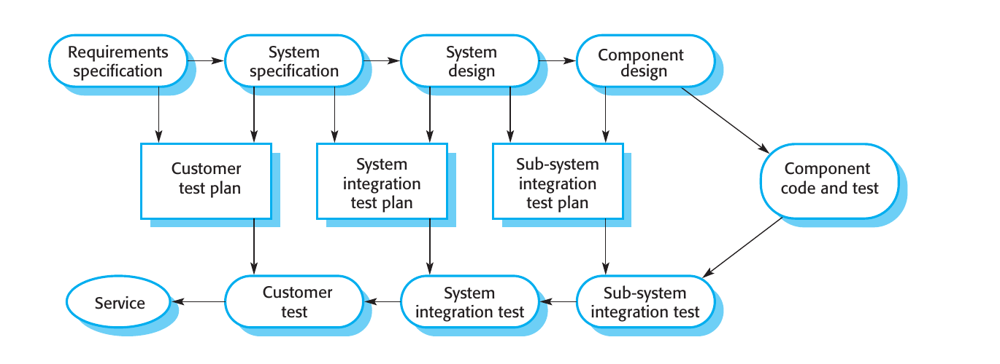
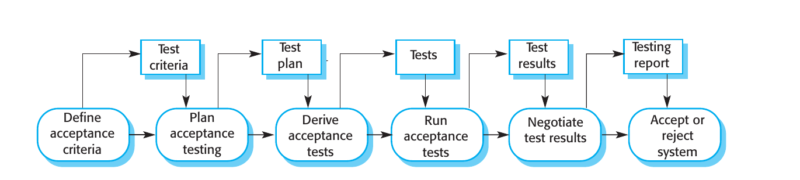

# Marco del proceso de feedback (v3)

## 1. Proceso de desarrollo de software (Sommerville) → requisitos y V&amp;V

Un **proceso de software** es *"una secuencia de actividades que conduce a la producción de un producto de
software"*, y **cuatro actividades fundamentales son comunes a todos los procesos de software**
[`sommerville2016software`, sec. 1.1.1]. El capítulo 2 las desarrolla como *process activities* (íd., sec. 2.2):

| #   | Actividad (Sommerville)         | Qué pasa ahí                                                                                                | Sec.  |
| --- | ------------------------------- | ----------------------------------------------------------------------------------------------------------- | ----- |
| 1   | **Especificación** del software | *"customers and engineers define the software that is to be produced and the constraints on its operation"* | 2.2.1 |
| 2   | **Diseño e implementación**     | el software se diseña y se programa                                                                         | 2.2.2 |
| 3   | **Validación** (V&amp;V)        | *"the software is checked to ensure that it is what the customer requires"*                                 | 2.2.3 |
| 4   | **Evolución**                   | el software se modifica para reflejar requisitos cambiantes del cliente y del mercado                       | 2.2.4 |

Estas actividades genéricas *"pueden organizarse de distintas formas y describirse a distintos niveles de detalle,
según el tipo de software"* [`sommerville2016software`, sec. 1.1.1]: por eso el marco puede ser agnóstico al modelo
de proceso.

**De las cuatro, dos involucran directamente al stakeholder** y son el foco de este documento:

- **Especificación / requisitos (1).** Por definición se hace *con* el cliente (cap. 4, *requirements engineering*).
- **Validación / V&amp;V (3).** El chequeo es contra *lo que el cliente requiere*, no solo contra el documento: la
V&amp;V *"muestra que un sistema tanto se ajusta a su especificación como cumple las expectativas del cliente"*
[sec. 2.2.3]. Dentro de V&amp;V, el *user testing* y el *acceptance testing* son las instancias donde el stakeholder
participa en persona [sec. 8.4].

Diseño/implementación (2) es interna al equipo. Evolución (4) nace del stakeholder (sus requisitos cambiantes),
pero el intercambio ocurre a través de las otras dos: el cambio entra como requisito nuevo y se acepta validando lo
modificado. Por eso el foco queda en 1 y 3; 2 y 4 son el trabajo del equipo entre ambos.

## 2. Verificación y validación: el V-model → las puntas son el feedback del stakeholder

El V-model ordena las actividades del proceso en una **V**: la rama descendente son las etapas de definición
(*verificación*) y la ascendente las de prueba (*validación*), con la codificación en el vértice
[`pressman2020software`, cap. 2]. Lo relevante para este marco no son los niveles en sí, sino las **flechas
horizontales**: cada nivel de definición tiene su nivel de prueba correspondiente, y **se prueba contra lo que ese
nivel definió**.

*Fig. 2.7 de Sommerville (2016), sec. 2.2.3, "Testing phases in a plan-driven software process". Es la versión
citable del V-model: el propio texto dice* "This is sometimes called the V-model of development (**turn it on its
side to see the V**)". *Reproducción literal del ejemplar, con fines académicos.*

Leída como V, la figura empareja cada nivel de definición con su nivel de prueba mediante el plan que los conecta:

| Rama de definición (verificación) | Plan que los une                 | Rama de prueba (validación)         |
| --------------------------------- | -------------------------------- | ----------------------------------- |
| **Requirements specification**    | Customer test plan               | **Customer test**                   |
| System specification              | System integration test plan     | System integration test             |
| System design                     | Sub-system integration test plan | Sub-system integration test         |
| Component design                  |                                  | *Component code and test* (vértice) |

**El nivel superior es el único donde participa el stakeholder**, y aparece en las dos puntas:

- **Punta izquierda (requirements specification):** el stakeholder dice *qué necesita*.
- **Punta derecha (customer test):** el stakeholder dice *si lo construido es lo que quería*. Es la instancia de
aceptación: el *acceptance testing* es el *user testing* donde *"the customer formally tests a system"*
[`sommerville2016software`, sec. 8.4].

La flecha horizontal que las une expresa que **la aceptación se evalúa contra los requisitos que ese mismo
stakeholder planteó**: los dos puntos de feedback son las dos mitades de un mismo circuito. Los niveles inferiores
(integración de sistema, de subsistemas y componentes) son internos al equipo; por eso el marco se queda con la
punta de arriba.

La formulación clásica de las dos ramas es de Boehm (1979): *"Validation: Are we building the right product? ·
Verification: Are we building the product right?"* [citado en `sommerville2016software`, cap. 8, introducción].
Como fuente del modelo se cita `pressman2020software`, cap. 2, con la misma correspondencia superior
**requisitos ↔ aceptación**; como origen histórico, `rook1986controlling`.

> ⚠ Tanto Pressman como Sommerville presentan el V-model como variante de **cascada**. Acá entra como
> **ilustración de la correspondencia** definición ↔ prueba, no como modelo de proceso a seguir. Cuántas veces se
> recorre la V es justamente lo que cambia entre modelos, y eso es lo que abre la sección 3.

## 3. Esto toma distintas formas: el ejemplo de Scrum (sin IA)

Las dos puntas de la sección 2 no ocurren una sola vez ni en un único orden: **cuántas veces se recorre la V depende
del modelo de proceso**. En un proceso en cascada se recorre una vez (los requisitos al inicio, la aceptación al
final). En uno **iterativo e incremental** se recorre en cada iteración: cada entrega vuelve a abrir los dos puntos,
y la aceptación de una iteración alimenta los requisitos de la siguiente.

Lo que sigue es **un ejemplo**, no la base del marco: se toma Scrum porque es la forma de trabajo más extendida y da
nombres establecidos a las actividades. El objetivo es describir **cómo viene siendo hoy** la interacción con el
stakeholder, **sin IA**: la línea de base contra la cual la sección 4 contrasta lo que cambia.

### 3.1. Qué define Scrum y qué no

Scrum define **una** instancia de contacto con el stakeholder, la **Sprint Review**, y la define como sesión de
trabajo, no como reunión de aprobación (Scrum Guide 2020, p. 9):

> *"The Sprint Review is a working session and the Scrum Team should avoid limiting it to a presentation."*

Dos precisiones del propio framework, importantes para el marco:

- **La liberación está desacoplada de la ceremonia por diseño** (p. 12): *"an Increment may be delivered to
stakeholders prior to the end of the Sprint. The Sprint Review should never be considered a gate to releasing
value."* Es decir: **el feedback puede llegar antes de la ceremonia y por fuera de ella**, habilitado por el
propio Scrum.
- **La ceremonia no alcanza para contener lo que se estudia**: está acotada a un máximo de cuatro horas. El uso real
del producto y la detección de desvíos no caben ahí ni están definidos ahí.

Y lo que Scrum **no** define: en el texto completo de la Guía, **`feedback`, `test`/`testing` y `acceptance` no
aparecen ni una vez**; el framework se declara *"purposefully incomplete"*. Por eso la parte de ingeniería
(liberación, testing de aceptación, validación de reglas) se ancla fuera de Scrum, en Sommerville y Dumas.

### 3.2. El flujo, tal como ocurre hoy

Luego de que el equipo de desarrollo **libera un incremento**, éste se comunica al stakeholder. El stakeholder lo
**utiliza**, lo acepta o no, y genera un **feedback** que deriva en una de dos cosas: **incluir nuevos requisitos** o
**modificar** lo construido porque no lo valida contra los requisitos que él mismo definió, que es la flecha
superior del V-model (sec. 2).

Ese feedback se da hoy **por múltiples canales**: por escrito, por llamadas, o en instancias específicas  
generadas para que ocurra. En particular, la **Sprint Review** es una instancia definida para hacer una recorrida del
sistema con el propio usuario y poder:

- **validar reglas de negocio**: confirmar que lo considerado se corresponde con la regla real;
- **analizar factibilidad** de los cambios pedidos;
- **priorizar**: determinar el orden de los cambios, para un análisis de factibilidad posterior y decidir si ese
feedback se incorpora o no a la próxima iteración.

El tramo completo, con los códigos del v2 para trazabilidad (`MARCO_PROCESO_FEEDBACK_v2.md`):

*Vista BPMN del tramo (sprint 15): actividades A1 a A5 sobre los carriles de quién las hace, con las que Scrum no
define en punteado. Editable en `sprint 15/diagramas/marco_feedback_bpmn.drawio`.*

De todo eso, Scrum define la Sprint Review (A2c, p. 9) y el refinement (A5, p. 10); define solo parcialmente la
incorporación al Product Backlog (A4, p. 6) y la validación de factibilidad técnica (A3b, anclada en Sommerville
sec. 25.3). El resto queda fuera y se ancla en los manuales: la liberación del incremento (A2a) en Sommerville
secs. 2.3.2 y 8.3, el uso y testing de aceptación (A2b) en Sommerville secs. 8.4 y 20.4, y la validación de reglas
de negocio (A3a) en Dumas secs. 4.4 y 5.4.2.

**El feedback del negocio se genera en A2b y A2c**; el resto es lo que se hace con él. Y son **dos canales y dos
momentos**: el uso real del producto, que puede ser asincrónico y anterior a la ceremonia, y la ceremonia misma.

## 4. Feedback con IA: categorías de técnicas

La IAG reformula algunas de las dinámicas descritas. Esta sección agrupa los trabajos relevados en **categorías con
nombre**, describe de qué trata cada una y qué efecto tiene la IA ahí, con sus beneficios y sus riesgos.

**Criterio de clasificación.** Las categorías se ordenan por **qué operación hace la IA sobre el ciclo de feedback**:
no por actividad, no por modelo de proceso, no por fase del SDLC. Un mismo trabajo puede tocar más de una categoría;
donde pasa, se dice.

**Etiquetas de fuente:** **[corpus]** paper del mapeo sistemático · **[general]** los cuatro artículos sobre IAG en el
desarrollo · **[gris]** preprint o prensa profesional, sin peer review · **[producto]** evidencia de mercado.

> **Alcance.** El corpus se armó con el string del sprint 5 (`"generative AI" AND ("business users" OR clients OR
> stakeholders) AND "software development"`), que apunta exactamente al tema de la tesis, y de él salen las
> categorías que siguen. La búsqueda dirigida de 4.7 no lo corrige: lo complementa con el vocabulario propio del
> tramo de aceptación (*acceptance testing*, *acceptance criteria*, UAT, Gherkin), que un paper de esa literatura
> puede usar sin nombrar "generative AI" ni "stakeholders". Hecha esa segunda pasada, el hueco sobre la validación
> del stakeholder en software construido sigue vacío: es real con los dos vocabularios.

### 4.1. La IA **emite** el feedback: impersonación de stakeholders

Una IA configurada para representar a un stakeholder y emitir feedback como si fuera él, sin depender de su
disponibilidad. Es la categoría que más directamente toca el **objetivo C**.

- **Efecto:** el stakeholder deja de ser el único emisor y pasa a **validador** de lo que la IA devolvió. El beneficio
que se le atribuye es la disponibilidad continua (feedback 24/7, sin coordinar agendas).
- **Riesgo:** no es el stakeholder real. El límite lo formula REConnect, que pide que el humano quede como
*"curator of AI outputs"* **[gris: `damian2025reconnect` v1]**; el paper *no* critica la impersonación (avala las
personas sintéticas si un humano las cura), así que sirve como límite a la **sustitución**, no a la técnica.
- **Objetivo B:** altera **frecuencia** y **temporalidad**.

> ⚠ **Esta categoría no tiene respaldo del corpus:** queda sostenida solo por Pirozzi (2024, revista profesional,
> **no peer-reviewed**) y por productos; se declara entonces [gris]+[producto]. (`raftopoulos2024designing` no
> trata de esto: es co-diseño pre-IAG, sin LLMs; queda como antecedente para el objetivo A.)

### 4.2. La IA **captura** lo que se dijo: asistentes de reunión

Asistentes LLM que acompañan una reunión y devuelven resumen, tickets y señales de riesgo
**[corpus: `cabrero2024exploring`]**.

- **Limitación fuerte:** el estudio cubre **Daily Scrum y refinamiento**, reuniones internas del equipo
(`Sprint Review` = 0, `client` = 0 apariciones). Es coordinación intra-equipo, no intercambio con el stakeholder:
entra como contexto, no como núcleo.
- **Qué hace, verificado:** detecta riesgos de sobrecompromiso e impedimentos no visualizados; resume el Daily. **No
transcribe**: los autores lo declaran trabajo futuro y alimentan el asistente con planillas cargadas a mano.
- **Riesgo:** qué se pierde en el resumen; y si la presencia del asistente cambia lo que se dice.
- **Señalado, sin verificar:** *RECOVER* (Voria et al., IEEE TSE 2025), requisitos desde conversaciones con
stakeholders; fuera del corpus y con ficha sin verificar contra el PDF.
- **Objetivo B:** altera **granularidad** del registro.

### 4.3. La IA **trabaja el artefacto de requisito**: formular, revisar, juzgar, rutear

Reformular el enunciado, evaluar su calidad y convertir input disperso en trabajo accionable: es la misma operación
sobre el mismo artefacto; lo que cambia es si la salida es una reescritura, un veredicto o un ticket.

- **Reformulación asistida del enunciado del stakeholder** **[corpus: `mircea2026supporting`, REFSQ 2026]**: el
participante escribe cinco user stories, un LLM se las devuelve reescritas y él las compara. 26 participantes, 130
pares; todas las dimensiones mejoran (p&lt;.001), el 43 % de las revisiones sacó a la luz aspectos no mencionados
que el participante consideraba importantes, y solo el 5 % introdujo errores. El LLM **no genera ni juzga**:
reformula para que el humano apruebe (su encuadre propio, **"AI-in-the-Loop"**).
⚠ **Alcance:** los 26 son *"software engineering students and professionals"*, **no hay actores de negocio**, y es
elicitación sobre un IDE hipotético: no hay software construido en ningún punto.
- **Generación asistida de criterios de aceptación** **[corpus: `abbasi2025towards`]**: el prototipo se llama
*Acceptance Criteria Assistant*: el ingeniero entra una user story y elige o edita los criterios que proponen
varios modelos. ⚠ **Sin evaluación empírica** (la evaluación con practicantes está planificada, no hecha) y **el
usuario es el ingeniero de requisitos, no el stakeholder**.
- **Evaluación automática de la calidad del artefacto** **[gris: `geyer2025epics`]**: LLMs que *evalúan* la calidad
de épicas; la IA juzga, no genera. Evaluadores: 17 product managers, no clientes.
- **De feedback disperso a trabajo accionable** **[gris: `torun2025bugtracking`]**: reportes de bug en lenguaje
natural que la IA completa con preguntas de seguimiento cuando faltan pasos de reproducción, y luego intenta
reproducir. **Es el único trabajo del corpus que opera sobre software ya construido.** Se suman productos que van
de feedback a tickets o de entrevistas a reportes **[producto: `kraftful`, `versive`]**.
- **Señalado, sin verificar:** *Quest-RE* (Hasso et al. 2024), preguntas de elicitación (la misma operación que
Torun, aguas arriba); fuera del corpus y con ficha sin verificar contra el PDF.
- **Riesgo transversal:** que el LLM *sustituya* la intención original en vez de articularla; y que el criterio del
evaluador automático reemplace al del negocio sin que nadie lo note.
- **Objetivo B:** altera **granularidad** y **secuencia**.

> Las tres revisiones sistemáticas del área (**[corpus: `vasudevan2025role`, `fischer2026generative`,
> `cheng2026generative`]**) **no** son evidencia de esta categoría: se usan en 4.7 para encuadrar; la evidencia
> primaria acá son 4 estudios. `stein2026integrating` fue removido: es *benchmarking* contra ground truth, sin
> humano en el loop.

### 4.4. La IA **construye** algo mirable o ejecutable: materialización temprana

En vez de devolver texto, se devuelve algo con lo que el stakeholder puede interactuar. Es la categoría más ligada a
la **validación temprana**, y se subdivide por **quién opera la herramienta**.

**(a) La opera el equipo.** Prototipos de interfaz generados desde user stories **[corpus: `kretzer2025closing`]**;
prototipos analíticos y reportes visuales en BI **[gris: `busany2024bi`]**; elicitación y prototipado desde bocetos
**[gris: `alabsi2026empirical`]**.

**(b) La opera el usuario de negocio, sin intermediario técnico.** La visión de *end-user software engineering*, con
requisitos en lenguaje natural como artefacto central **[corpus: `robinson2025requirements`]**; productos que van de
la intención a la app **[producto: `emergent`]** y de la call al spec con criterios de aceptación *policy-aware*
**[producto: `pmagent`]**; y el fenómeno reportado de usuarios de negocio construyendo sus propias apps
**[gris: prensa profesional]**. Señalado sin verificar: el chatbot para no expertos sobre low-code/no-code de
De Troyer et al. (IFIP HCI 2025) mapearía acá.

- **Efecto:** adelanta el momento en que se puede reaccionar: se opina sobre algo concreto, no sobre una
descripción. Robinson lo formula bien: *"seeing a tangible product can unearth elements of the requirements that
were assumed subconsciously but not articulated"*.
- **Riesgo:** el prototipo puede inducir la respuesta; validar rápido puede sacrificar calidad de UX en favor de la
velocidad **[general: Cornide-Reyes et al. 2025]**; y el pivote de dos productos relevados
**[producto: `tusk`, `sweep`]** sugiere que el modo autónomo sin validador humano todavía no cierra.
- **Objetivo B:** altera **temporalidad** (el momento en que el feedback es posible).

> ⚠ **Tres precisiones verificadas contra los PDF:**
>
> - **Kretzer no involucra al negocio:** es un plug-in de Figma para sincronización intra-equipo (UX, PO, devs);
> `client` = 0 apariciones y sin evaluación en co-diseño con stakeholders. Su aporte más cercano a esta tesis es
> la dirección inversa: derivar user stories desde interfaces existentes.
> - **Alabsi no tiene participantes:** el rol de stakeholder fue *simulado*, un solo sketch, 3 evaluadores técnicos
> y **una sola pasada**: no observó ningún ciclo de feedback, y su *"enables earlier validation"* es inferencial,
> no medido. Sirve como encuadre (el prototipo como *boundary object*) y como evidencia del hueco.
> - **Robinson es paper de visión** (TOSEM), sin estudio empírico: el mejor encaje conceptual del corpus, pero
> aporta agenda, no evidencia.

### 4.5. La IA **valida contra reglas y procesos de negocio**

Categoría necesaria para el **objetivo D** (validación de reglas de negocio y flujos operativos, la mitad del
planteo de esta tesis) y hoy **sin trabajos de validación propiamente dicha**.

- Lo más cercano en el corpus es **[corpus: `lindenberg2025business`, lectura por abstract]** (ICSOC 2025): un
framework de agentes LLM que **descubre** procesos de negocio mediante diálogo estructurado multi-turno
(metodología Gaia, cuatro configuraciones de agentes), evaluado por exactitud sobre tres procesos y tres LLMs,
**sin participantes humanos en la evaluación**. Es decir: opera aguas arriba, en el descubrimiento del proceso,
no en la validación de software construido contra reglas; y demuestra factibilidad técnica, no dinámicas con
stakeholders reales. Aun el trabajo más cercano al objetivo D deja esa celda vacía.
- El anclaje conceptual de la validación semántica de reglas contra el proceso real es **Dumas et al. (2018)**,
secs. 4.4 y 5.4.2, el mismo que sostiene la actividad A3a de la sec. 3.
- **Objetivo B:** sin evidencia para afirmar nada todavía.

### 4.6. Nota sobre el tramo técnico (generación de código con validación humana)

El **objetivo A** nombra el feedback *técnico*, y el **C** la reconfiguración del rol del developer. El corpus
académico no cubre ese tramo, pero la evidencia de mercado sí y está relevada: agentes que van de ticket a PR
**[producto: `devin`, `codegen`, `tusk`, `sweep`]**, con el developer como compuerta de aprobación.

Si entra al marco como categoría propia o se justifica su exclusión es una decisión abierta (ver *Qué falta*, al
final del documento).

### 4.7. Qué está cubierto y qué no: resultado de la búsqueda dirigida

Para responder esta pregunta se hizo una **búsqueda dirigida y documentada** (agosto 2026) con el vocabulario de
testing y aceptación, complementario al del string del corpus.

**Método.** Cuatro strings booleanos sobre la API de arXiv (con conteos exactos), 14 búsquedas web y 3 consultas a
Semantic Scholar, filtro 2023 en adelante:

| String (campo `abs:`)                                                                  | Total arXiv | Relevantes |
| -------------------------------------------------------------------------------------- | ----------- | ---------- |
| `"acceptance testing" AND ("large language model" OR "generative AI" OR LLM)`          | 13          | 6          |
| `"acceptance criteria" AND ("large language model" OR "generative AI" OR LLM)`         | 31          | 9          |
| `"user acceptance testing" OR "UAT"`                                                   | 55 ⚠        | ~4         |
| `("acceptance test" OR "acceptance tests") AND (Gherkin OR BDD OR "behaviour-driven")` | 7           | 5          |

⚠ El total de 55 está contaminado: en arXiv, "UAT" matchea mayoritariamente *Universal Approximation Theorem*. **No
citar ese número.**

**Resultado: 24 trabajos de tipo A, 0 de tipo B.**

- **Tipo A, generar el artefacto** (tests, criterios, escenarios Gherkin). Actividad técnica; el usuario es
developer, tester o PO revisando artefactos. Cuerpo consolidado y creciente, 2024–2026, en AST, ASE, ISSTA, ICSE,
RE, SIGCSE, SAC.
- **Tipo B, estudiar la interacción de validación del stakeholder**: una persona de negocio usando el software
construido y devolviendo si es lo que pidió. **Ninguno.**

**El hueco es real y no es un efecto del vocabulario de búsqueda:** se buscó también con los términos propios de la
aceptación y tampoco apareció.

#### Tres piezas que lo demuestran sin depender de una ausencia

1. **Por contradicción.** *XUAT-Copilot* es el único trabajo con "User Acceptance Testing" en el título, y su
 contribución es **sacar al humano del UAT**: tres agentes LLM automatizan los scripts. Lo mismo hace
 *GUISpector* con la verificación de prototipos GUI: automatiza justamente la validación que haría el stakeholder.
 El único campo dedicado a la aceptación trata el rol humano como trabajo a eliminar, no como interacción a
 estudiar.
2. **El campo registra la práctica y no la estudia.** Fonseca et al. (ASE 2025, caso BMW) reportan como hallazgo
 *lateral* que el Gherkin generado terminó usándose como **artefacto de validación revisado por stakeholders** en
 vez de ejecutarse. Es evidencia práctica de que la validación del stakeholder ocurre en la industria, dentro de
 un paper que estudia otra cosa.
3. **Asimetría industria ↔ academia.** Las búsquedas de *product owner / business analyst + validación + empírico* y
 de *vibe coding + no programadores + empírico* devolvieron **0 papers y 18 de 18 enlaces comerciales** (blogs de
 consultoras, Scrum.org, cursos). La industria habla del tema constantemente; la literatura no lo cubre.

#### Dónde está el hueco, exactamente

Cruzando **quién es el sujeto** con **en qué momento del ciclo actúa la IA**:

|                                    | La IA procesa feedback **ya emitido**    | La IA media **el acto de emitirlo** |
| ---------------------------------- | ---------------------------------------- | ----------------------------------- |
| Sujeto = corpus de texto           | **Saturado**: minería de reviews con LLM | vacío                               |
| Sujeto = developer                 | trazabilidad issue↔commit                | **Poblado**: *vibe coding*          |
| Sujeto = **actor de negocio real** | casi vacío                               | ⬛ **el hueco**                      |

Los dos cuerpos grandes están desplazados **en las dos dimensiones a la vez**: la minería de reviews *digiere*
feedback ya emitido (el usuario es un corpus histórico, no una interacción), y en el *vibe coding* el no técnico
está **construyendo**, no validando lo que otro construyó. La formulación completa del hueco está en 6.1.

#### El hueco sobre el proceso de aceptación de Sommerville

El mismo resultado puede leerse sobre un diagrama canónico de manual. Sommerville descompone el *acceptance testing*
en **seis etapas** [`sommerville2016software`, sec. 8.4, Fig. 8.11]:

*Fig. 8.11 de Sommerville (2016), sec. 8.4, "The acceptance testing process". Reproducción literal del ejemplar,
con fines académicos.*

Cruzando esas etapas con lo relevado:

| Etapa                           | Cobertura en la literatura                                                                             |
| ------------------------------- | ------------------------------------------------------------------------------------------------------ |
| 1 · Define acceptance criteria  | **Cubierto**: `abbasi2025towards` (*Acceptance Criteria Assistant*), `stein2026integrating`, `pmagent` |
| 2 · Plan acceptance testing     | sin trabajos relevados                                                                                 |
| 3 · Derive acceptance tests     | **Cubierto**: el grueso de los 24 trabajos tipo A (user stories → Gherkin → scripts)                   |
| 4 · Run acceptance tests        | **Parcial**: hay trabajos que lo automatizan sacando al humano del circuito                            |
| 5 · **Negotiate test results**  | ⬛ **sin trabajos**                                                                                     |
| 6 · **Accept or reject system** | ⬛ **sin trabajos**                                                                                     |

El corte es limpio: **la literatura cubre las etapas donde el producto es un artefacto (1, 3, 4) y no toca aquellas
donde el producto es un acuerdo entre personas (5 y 6)**.

Y el propio Sommerville anticipa por qué. De la etapa 5: *"the developer and the customer have to **negotiate** to
decide if the system is good enough to be used"*. De la etapa 4: *"**It is difficult to automate this process** as
part of the acceptance tests may involve testing the interactions between end-users and the system"*. El manual dice
que ahí la interacción humana resiste la automatización, y es exactamente donde esta tesis se ubica.

#### Por qué el hueco importa: evidencia de que es un problema, no un nicho

Tres trabajos convergen en que **la capacidad de generar se democratizó y la de validar no**:

- **Virk y Liu (VL/HCC 2025)**: profesionales de marketing y ventas evaluando análisis generados por IA. Su
hallazgo: *"business professionals cannot reliably verify AI-generated data analyses on their own"*, y fallan **incluso
instruidos explícitamente a buscar errores**. Es el único trabajo hallado que pone actores de negocio reales a
validar salida de IA. (Objeto: un análisis de datos, no software funcionando; ahí queda el margen de esta tesis.)
- **Fawzy et al. (2026)**: 162 *vibe coders* (no programadores, novatos y profesionales) y el *perception–action
gap*; el *vibe coding* *"is partially democratising as it broadens access to software creation without equally
distributing the expertise to evaluate it"*.
- **Sharma et al. (2026), *Feedback by Design***: cuatro barreras al feedback de calidad, derivadas de las máximas
de Grice: **common ground, verifiability, communication, informativeness**. Es andamiaje conceptual casi directo
para este marco y para el diseño de la PoC.

Y los dos papers del corpus que más prometían materialización temprana **declaran esta misma ausencia como
limitación y trabajo futuro**: `mircea2026supporting` (los participantes son técnicos; en grupos *"with limited
articulation ability"* los efectos podrían variar) y `alabsi2026empirical` (evaluadores todos técnicos, que *"may
not fully represent the perspectives of non-technical stakeholders"*).

Las cautelas de citado para la memoria final están registradas en `NOTAS_MEMORIA.md`.

### 4.8. Qué dimensión del ciclo altera cada categoría (objetivo B)

El objetivo B pregunta por cambios en **frecuencia, secuencia, granularidad y temporalidad** de los intercambios de
validación. Leídas con esa grilla, las categorías no son intercambiables:

| Categoría                          | Frecuencia | Secuencia | Granularidad | Temporalidad |
| ---------------------------------- | :----------: | :---------: | :------------: | :------------: |
| 4.1 La IA emite el feedback        | ✦          |           |              | ✦            |
| 4.2 La IA captura lo dicho         |            |           | ✦            |              |
| 4.3 La IA trabaja el artefacto     |            | ✦         | ✦            |              |
| 4.4 La IA construye algo mirable   |            | ✦         |              | ✦            |
| 4.5 La IA valida reglas de negocio |            |           |              |              |

Lecturas que se desprenden:

- **La frecuencia solo la altera 4.1**, la única que rompe la dependencia de la agenda del stakeholder porque
sustituye al emisor.
- **La temporalidad la alteran 4.1 y 4.4** por vías opuestas: sustituir a quien da el feedback, o adelantar el
momento en que hay algo que mirar. Solo la segunda mantiene al stakeholder real en el circuito.
- **4.5 queda sin marcas**: no hay evidencia de esa operación con IA todavía (ver 4.5).
- **Ninguna categoría altera las cuatro dimensiones**: el estado del arte sostiene desplazamientos parciales, no
un cambio integral del ciclo.

## 5. Dónde caen estas categorías en los escenarios S1–S4

Todo lo de la sección 4 muestra un mismo movimiento de fondo: actividades que hoy hace una persona empiezan a ser
asumidas por la IA. **Sauvola et al. (2024)** dan una escala para graduar ese movimiento (sus Tablas 1 y 2), y es
lo que permite ordenar las categorías por **cuánto** desplazan al humano, no por qué actividad tocan.

Figura **propia** a partir de las Tablas 1 y 2 del paper; editable en `sprint 15/diagramas/escenarios_s1_s4.drawio`.

| Escenario                                            | En una línea                                                            | Dónde caen las categorías                                                                                                                                                   |
| ---------------------------------------------------- | ----------------------------------------------------------------------- | --------------------------------------------------------------------------------------------------------------------------------------------------------------------------- |
| **S1** *Traditional Software Development Operations* | Humanos en todos los roles; las herramientas automatizan                | Es el proceso **de hoy**, la línea de base de la sec. 3                                                                                                                     |
| **S2** *AI in loop*                                  | El humano domina; la IA automatiza partes de tareas y asiste decisiones | **La mayor parte del estado del arte**: 4.2 (asistentes de reunión), 4.3 (reformular, juzgar, rutear) y la rama (a) de 4.4, donde el equipo opera la herramienta            |
| **S3** *AI assumes role(s)*                          | La IA asume roles seleccionados; el humano controla la operación        | Dos puntos: **4.1**, donde la IA asume el rol de quien emite el feedback, y la rama (b) de **4.4**, donde el actor de negocio construye y el developer queda como compuerta |
| **S4** *Human-in-the-loop*                           | La IA gestiona varios roles; el humano vigila                           | **Ninguna categoría llega.** El candidato sería el tramo técnico autónomo (4.6), y el pivote de dos de los productos relevados sugiere que ese modo todavía no cierra       |

**Qué se lee del mapeo.** El estado del arte se concentra en **S2** y toca **S3** en dos puntos; **nada llega a S4**.
Es un resultado, no una omisión: en ninguna de las vías relevadas el humano sale del circuito. Y las dos que llegan
a S3 lo hacen de maneras incompatibles entre sí: o la IA sustituye a quien emite el feedback (4.1), o lo emite un
humano de negocio que ahora también construye (4.4b).

> **Salvedades del mapeo** (Daniel pidió no forzar el encaje): (a) los escenarios de Sauvola describen **la
> organización del trabajo de desarrollo**, no específicamente el ciclo de feedback con el stakeholder: el mapeo es
> una lectura nuestra; (b) varias categorías tienen ramas en escenarios distintos (4.4 sobre todo): lo que se ubica
> en el gráfico no siempre es la categoría entera.

## 6. Aspectos no considerados y problemas abiertos

Cierra el estado del arte con lo que **no** está cubierto. Es contexto para decidir por dónde encarar la
experimentación, **no una propuesta**.

### 6.1. El hueco principal

La **instancia de aceptación con el stakeholder real sobre software funcionando**. Enunciado como desplazamiento,
no como ausencia: hay un cuerpo consolidado sobre generar el *artefacto* de aceptación y literatura abundante sobre
IA que *procesa* feedback ya emitido; no hay trabajo empírico sobre cómo se reconfigura la **interacción** de
validación (evidencia en 4.7).

### 6.2. Necesidades sin trabajo asociado

- **Validación de reglas y flujos de negocio con IAG (objetivo D).** La categoría 4.5 no tiene trabajos de
validación propiamente dicha: la mitad del planteo de esta tesis no encuentra respaldo en la literatura relevada.
- **El actor de negocio como validador de lo que la IA produjo.** La evidencia disponible sugiere que **no lo logra
de forma confiable** (4.7): la capacidad de generar se democratizó y la de validar no. Nadie estudia qué
andamiajes cerrarían esa brecha.
- **La calidad del feedback que el stakeholder logra emitir.** Las cuatro barreras de Sharma et al. (4.7) están
formuladas para agentes conversacionales, no para el ciclo cliente↔equipo de desarrollo. Trasladarlas es trabajo
abierto.
- **El tramo técnico** (4.6), si se decide dejarlo fuera del marco.

### 6.3. Lo que queda fuera de alcance por decisión, no por vacío

- **Feedback indirecto por telemetría / ML** (analítica de uso, auto-PRs, detección de fricción). Hay productos y
literatura, pero el foco de esta tesis es la interacción con un representante que prueba y opina de forma verbal
(ver *Definiciones*). Vale registrar la observación del tutor: ese feedback **igual termina entrando al equipo
como feedback normal**, y su incorporación depende de otros stakeholders (quién paga, factibilidad).
- **Minería de reviews de app stores con LLM.** El subcampo más poblado de todos los relevados (~15 trabajos), pero
opera sobre feedback ya emitido (ver la matriz de 4.7). Se menciona solo **como contraste**.
- **Elicitación inicial y prototipado.** Quedan fuera del objeto, pero **no** de la sección 4: son la literatura
adyacente que enmarca el hueco.

### 6.4. Limitaciones de este relevamiento

- El string del corpus y la búsqueda dirigida de 4.7 usan vocabularios complementarios (tema de la tesis y tramo
de aceptación); ninguno reemplaza al otro. La búsqueda dirigida tiene conteos exactos solo de arXiv: ACM DL,
SpringerLink e IEEE Xplore se cubrieron de forma indirecta, vía los DOI recuperados desde arXiv y Semantic Scholar.
- La lectura de **`lindenberg2025business`** (4.5) se basa solo en su abstract; el texto completo no está
disponible.
- Parte de la evidencia de mercado (productos) **no es académica** y se etiqueta como tal.

---

## Definiciones

- **Stakeholder.** *"System stakeholders include anyone who is affected by the system in some way and so anyone
who has a legitimate interest in it. Stakeholders range from end-users of a system through managers to external
stakeholders such as regulators, who certify the acceptability of the system"*
[`sommerville2016software`, cap. 4, introducción]. La definición es amplia; esta tesis se acota a **un
representante del negocio que prueba el producto y opina de forma verbal**. El feedback indirecto (telemetría,
ML, auto-PRs) queda fuera de alcance. El recorte es nuestro, no de Sommerville.
- **Analista funcional.** Rol clásico de validación de reglas de negocio. No se formaliza por ahora; queda para
decidir si es un rol propio o se absorbe en el Product Owner.

---

## Qué falta

| #   | Falta                             | Por qué / cómo se destraba                                                                                                                                                                                                                                                                                                                                                                                                                                                                                                                                                             |
| --- | --------------------------------- | -------------------------------------------------------------------------------------------------------------------------------------------------------------------------------------------------------------------------------------------------------------------------------------------------------------------------------------------------------------------------------------------------------------------------------------------------------------------------------------------------------------------------------------------------------------------------------------- |
| 1   | **Decisiones de Victoria/Daniel** | (a) el tramo técnico de 4.6: el objetivo A lo nombra y hoy el marco no lo cubre; nota: Perry et al. (2023) y Vaithilingam et al. (2022), referencias clave del proyecto sobre esa dimensión, no están citadas en el marco. (b) La sec. 3.2 quedó como párrafos más el BPMN del v2; confirmar con Daniel si el diagrama se queda (puede leerse como que Scrum vuelve a ser la base). (c) Si el *"firewall" de feedback* (sprint 11) vuelve como línea de la PoC. |
| 2   | **Redacción final**               | Una pasada de estilo después del feedback de Daniel sobre esta versión.                                                                                                                                                                                                                                                                                                                                                                                                                                                                                                                |
| 3   | **To-do de largo plazo**          | (a) La lectura de `lindenberg2025business` en 4.5 se basa en su abstract; si el PDF aparece alguna vez, verificarla. (b) Lo demás que recién importa al redactar la memoria está en `NOTAS_MEMORIA.md`.                                                                                                                                                                                                                                                                                                                                                                                |

**Meta v3:** versión escrita y prolija para decidir por dónde encarar la experimentación / PoC.