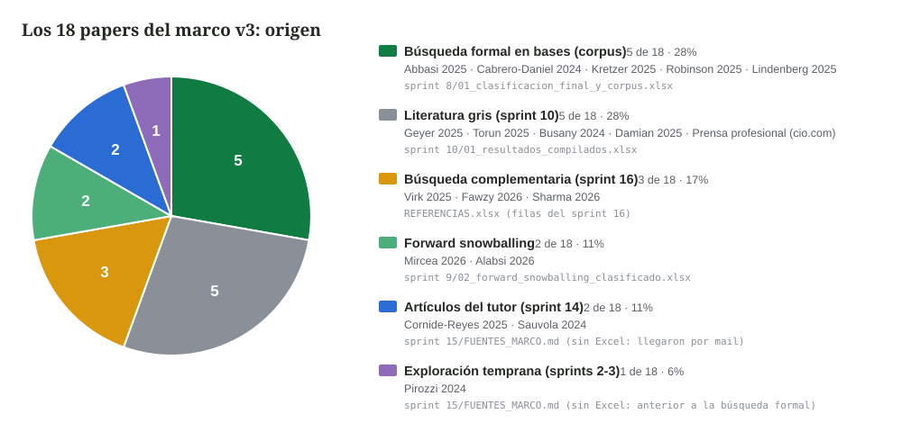
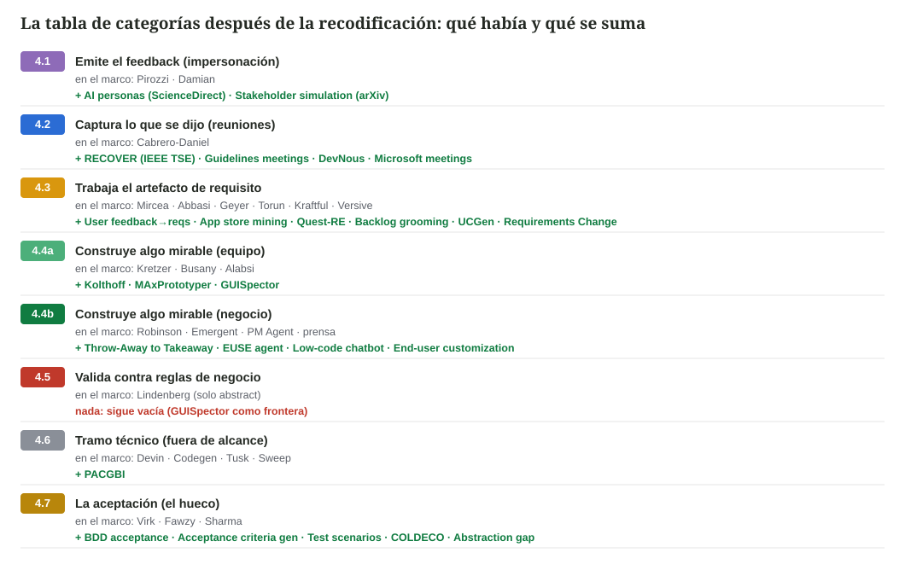

# Call del 24/8: de dónde salió lo del marco v3 y qué suma la recodificación

## Punto de partida: los 18 papers del marco, por vía de entrada

- Se validó cada paper citado en el marco: los 18 aparecen en alguna planilla o documento del proceso. Ninguno salió de la nada.
- Caso especial: Geyer, Torun y Busany aparecieron en las búsquedas originales, los descartamos en el filtrado, y reaparecieron en la búsqueda de literatura gris. Hoy se citan.
- Conclusión: el protocolo formal no fue el que produjo los artículos que usamos. Por eso el proceso se presenta como revisión bibliográfica y no como SLR.
- Detalle paper por paper en `CHEQUEO_CORPUS.md`.

## Qué se pedía (call anterior)

- Validar el origen de cada referencia de la tabla. Hecho: gráfico de arriba.
- Recodificar los descartados de las primeras fases contra las categorías nuevas. Hecho: gráfico de abajo.
- Objetivo de las dos: dejar la tabla de categorías lo más completa posible antes de decidir la PoC.

## La recodificación, en una imagen

- Se releyeron los descartados de todas las planillas (sprints 6, 8, 9 y 10).
- Volumen: 1066 filas únicas, 389 con vocabulario de feedback más IAG.
- Criterio: ¿cae en alguna categoría de la tabla con el foco nuevo?
- En el gráfico: la línea gris es lo que el marco ya cita; la línea verde son los descartados que se proponen sumar.
- El marco v3 no se modificó. Los verdes son candidatos a discutir hoy; se decide en conjunto cuáles entran.

## Lo que deja la recodificación

- Los azules del sprint 8 (apartados "para después") eran el lugar correcto: 4 de los 8 caen directo en la tabla de categorías, incluido el mejor hallazgo, *From Throw-Away to Takeaway* (no técnicos con vibe coding, con empiria) para 4.4b.
- 4.1 gana su primera evidencia académica formal (*AI personas*, amarillo de ScienceDirect): hoy esa categoría estaba declarada sin respaldo del corpus.
- **4.5 sigue vacía también entre los descartados** y todo lo de aceptación que apareció genera el artefacto o automatiza, nada sobre la validación del stakeholder. Los dos huecos de la tesis resisten la recodificación.
- Los verdes sin usar que son surveys (Vasudevan, Cheng, Fischer y Lang) van a related work, no a la tabla de categorías. El "verde de Google" era el propio paper de Geyer.

## Temas abiertos para hoy

- Cómo formular la sección de revisión en el documento final (quedó en "vamos viendo").
- Alabsi figura [gris] pero es lote 2 del mapeo; definir si la etiqueta indica origen o tipo.
- Pirozzi falta en `REFERENCIAS.xlsx`; sumarla al unificar el bib.
- Busany se cita en 4.4a con la cautela de su descarte del sprint 9.
- Objetivos: "efectos percibidos" se transforma o cae (sin entrevistas); se resuelve al reescribir la introducción.

## Anexo

- Ficha de cada candidato (autores, venue, link, por qué cae, cautela): `TABLA_CATEGORIAS_COMPLETA.md`.
- Recorrido fila por fila de las 18 referencias del marco: `CHEQUEO_CORPUS.md`.
