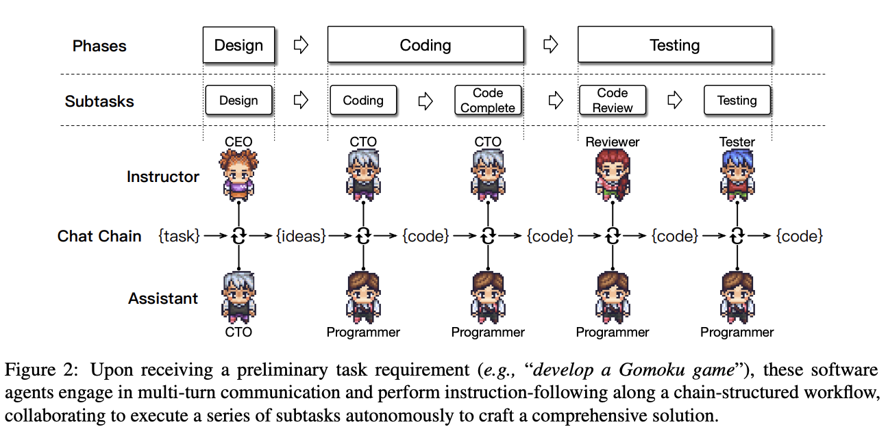
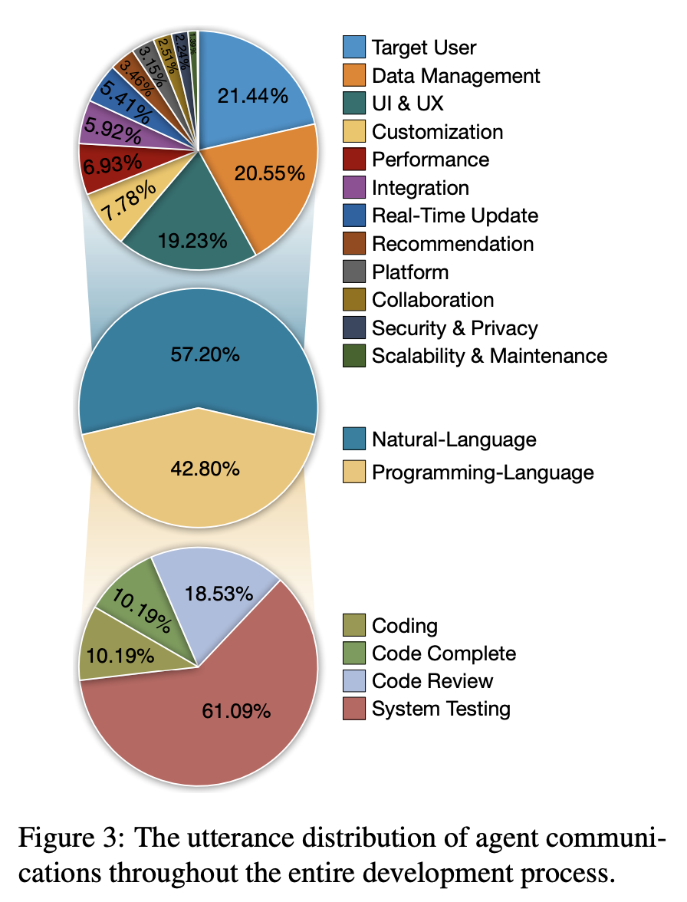
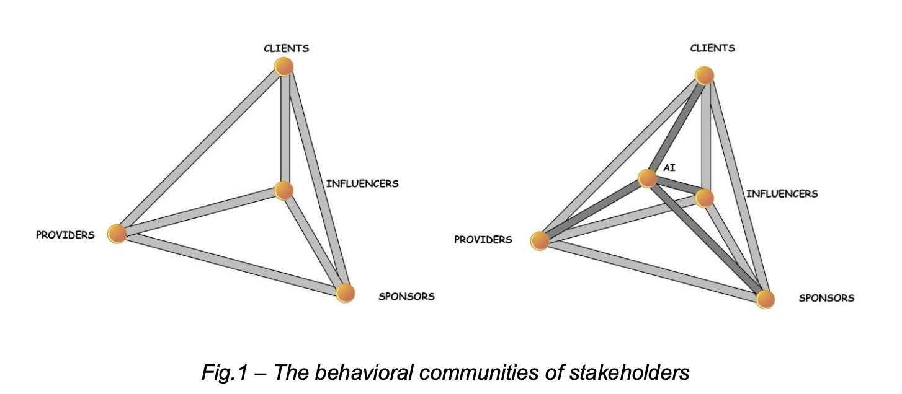
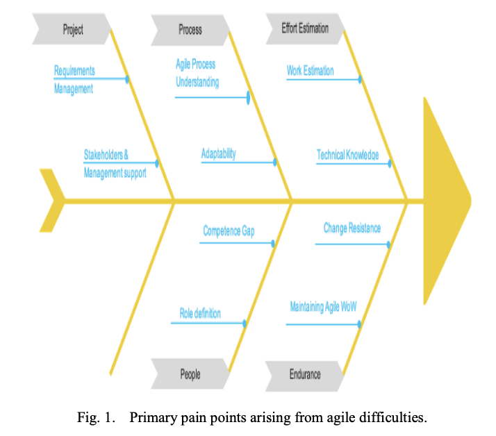

# Sprint 3 — 5 mar → 18 mar 2026

---

## Ideas generales

- La tesis está muy vinculada a **BDD (Behavior-Driven Development)**:
  - BDD = lenguaje compartido entre técnicos y no técnicos para traducir intención de negocio a comportamiento verificable
  - Conecta directamente con el objetivo D (validación temprana de reglas de negocio y criterios de aceptación) y el F (PoC orientada a usuarios no técnicos)
  - IAG puede potenciar ese ciclo: generar, refinar o validar especificaciones automáticamente
  - El paper de AgileGen refuerza esto: propone Gherkin (Given/When/Then) como intermediario principal con el usuario

- La IAG permite construir una memoria reutilizable de decisiones de negocio (escenarios, criterios) que se aprovecha en proyectos futuros, generando aprendizaje inter-proyecto. — Empowering Agile-Based Generative Software Development through Human-AI Teamwork

- La IAG se configura como un stakeholder con poder estructural: no tiene intereses propios, pero influye en decisiones, opciones y dinámicas del proceso mediante su capacidad analítica y acceso a datos. — The Stakeholder Perspective in the Generative AI Scenario and the AI-Stakeholders

- Explorar también **MDD (Model-Driven Development)** como enfoque relacionado

---

## Papers leídos

### Empowering Agile-Based Generative Software Development through Human-AI Teamwork

[Fuente](https://dl.acm.org/doi/full/10.1145/3702987) — Publicado: 03 de julio de 2025

#### Notas

- Proponen **Gherkin** como principal intermediario con el usuario
- Proponen un framework llamado **AgileGen**
- Los agentes se dividen en **cuatro categorías**, una de ellas es:
  - **Questioning Agent** (e.g., GPT-Engineer, GPT-Pilot): generan preguntas relacionadas con los requerimientos del usuario, expanden los requerimientos y generan código automáticamente
- Luego los clasifican según si caen en **waterfall** o **agile**
- Probaron AgileGen con **40 proyectos**
- **Aprendizaje mediante experiencia humana**: las decisiones del usuario se guardan como nuevo conocimiento en la memoria, creando una base de experiencias que mejora futuras generaciones de requisitos y escenarios
- **Ver después**: sección 5.1.1 RQ1.1 (métricas automáticas de calidad de código) — útil si creamos un artefacto y queremos medirlo

#### Claimean innovar en:

1. **Metodología de colaboración humano-agente**: el usuario participa al inicio (decisión de escenarios) y al final (aceptación) de cada iteración, el agente hace los pasos intermedios. A diferencia de métodos fully automated (ChatDev, MetaGPT) que acumulan errores, y de los que piden mucho input técnico (GPT-Engineer, GPT-Pilot).
2. **Introducción de BDD en agentes generativos**: son los primeros en usar Gherkin para generar escenarios de usuario y criterios de aceptación, cerrando la brecha entre requerimientos incompletos y funcionalidades precisas. Iteración incremental tipo agile en vez de end-to-end donde los errores se propagan.
3. **Agent graph con memory pool**: extienden AI-Chain a un grafo dirigido cíclico con puntos de decisión humana. Incluyen un memory pool que recolecta decisiones de usuarios y las recomienda a futuros usuarios con requerimientos similares.

#### Citas

**Importancia 1**

"According to a survey on the popularity of requirement specification symbols conducted by Kassab and Laplante in 2022, 69% of respondents in RE surveys indicated that requirements are expressed in NL, i.e., informally. Therefore, problems exist in the raw requirements collected from users, including incomplete. The issues in these raw requirements can lead to the developed software failing to meet the user’s acceptance criteria."

**Importancia 2**

"Finally, to improve the reliability of user scenarios, we also introduce a memory pool mechanism, collecting user decision-making scenarios and recommending them to new users with similar requirements."

"AgileGen, as a user-friendly interactive system, significantly outperformed existing best methods by 16.4% and garnered higher user satisfaction."

"Typically, software companies overcome this problem by hiring product managers"

**Importancia 3**

"However, users, constrained by their domain knowledge, result in a lack of effective acceptance criteria during the requirement completion, failing to fully capture the implicit needs of the user."

"Users are unsure how to drive the Agent to generate desired software, and the Agent does not know how to fulfill user requirements. We have built a bridge between users and the Agent, facilitating collaboration between human decision-making skills and the Agent’s coding capabilities. This collaboration has created a generative software development Agent with lightweight iterative feedback."

"Moreover, these agents follow the waterfall model, characterized by a top-down, sequentially linked order, which easily allows the propagation of biases from earlier to later stages. Especially for software development agents based on large language models, the inevitable hallucination issues of large language models can spread and accumulate within the waterfall model, leading to the generation of code that does not align with user requirements."

"AgileGen has designed three key decision-making processes: requirement proposal, clarification, and iterative acceptance with recommendations, focusing on the skills where end users excel."

## "the end-users are involved in (1) End-User Requirement Decision-Making, (2) Scenarios Decision-Making, and (3) Acceptance and Recommendation Decision-Making." - importancia 3

### ChatDev — Communicative Agents for Software Development

[Fuente](https://arxiv.org/abs/2307.07924) — Referenciado en el paper de AgileGen

- **PDF guardado**: `Communicative Agents for Software Development chatDev.pdf`
- **Repo**: https://github.com/OpenBMB/ChatDev/tree/main (31k+ estrellas — es un producto similar a lo que pienso!)
- **Review del paper**: https://medium.com/data-science/paper-review-communicative-agents-for-software-development-103d4d816fae

#### Qué hace

ChatDev es un sistema multi-agente impulsado por chat que organiza el desarrollo de software en subtareas coordinadas mediante una "chat chain", donde agentes con roles específicos colaboran y validan soluciones iterativamente para reducir errores y alucinaciones.

#### Ojo

ChatDev sigue una lógica bastante cercana al modelo waterfall, ya que, como dicen los autores, "mirrors the established waterfall model, meticulously dividing the development process into [...] designing, coding, testing, and documenting". Es decir, organiza el desarrollo en fases secuenciales bien definidas, algo que contrasta con enfoques más iterativos como Agile, pero que en este caso facilita la coordinación entre múltiples agentes.

#### Citas

**Importancia 1**

**Importancia 2**

"In this paper, we introduce ChatDev, a chat-powered software development framework in which specialized agents driven by large language models (LLMs) are guided in what to communicate (via chat chain) and how to communicate (via communicative dehallucination)."

"Large language models (LLMs) (...) combined with their strong capacity for roleplaying within designated roles (Park et al., 2023; Hua et al., 2023; Chen et al., 2023b)."

**Importancia 3**

"Datasets Note that, as of now, there isn't a publicly accessible dataset containing textual descriptions of software requirements in the context of agent-driven software development. To this end, we are actively working towards developing a comprehensive dataset for software requirement descriptions, which we refer to as SRDD (Software Requirement Description Dataset)."

#### Notas

- Miden la calidad del código evaluando si funciona correctamente (ejecutabilidad), cumple todos los requisitos (completitud) y es coherente con el diseño (consistencia)

---

### The Stakeholder Perspective in the Generative Artificial Intelligence Scenario and the AI-Stakeholders

[Fuente](https://pmworldlibrary.net/wp-content/uploads/2024/08/pmwj144-Aug2024-Pirozzi-Stakeholder-Perspective-in-Generative-AI-Scenario-and-AI-Stakeholders.pdf) — Publicado: agosto 2024

#### Notas

- El mayor cambio es conceptual: la IA ya no es solo una herramienta, sino un participante activo en los ecosistemas de stakeholders. El project management debe evolucionar de gestionar solo personas a gestionar personas + sistemas inteligentes.
- Se hace referencia al concepto de **Optimal Timing** en el engagement de stakeholders, algo que no habíamos considerado antes como dimensión de análisis.
- La IA ocupa un lugar único: no es un stakeholder tradicional (no tiene intereses propios ni stakes en los resultados), pero influye directamente en las decisiones, la trayectoria y el éxito de los proyectos. Es un actor sin agencia propia que igual reconfigura el ecosistema.

"Traditionally, power within stakeholder networks was often distributed based on factors such as financial investment, strategic importance, or regulatory authority. The advent of AI has introduced a new power center - one based on data control and analytical capability.

Key aspects of this power shift include:

- **Data as Currency**
- **Algorithmic Decision-Making**
- **Speed of Analysis**
- **Democratization of Expertise**
- **Reduced Human Bias**
  "

#### Citas

**Importancia 1**

"AI's ability to provide data-driven insights can help project managers make more informed decisions that align with stakeholders' expectations." — El feedback no es solo del stakeholder hacia los desarrolladores; la IA habilita un flujo inverso donde el equipo técnico puede anticipar y alinearse con las expectativas del negocio.

**Importancia 2**

"Stakeholders are increasingly expecting transparency and accountability in project management. AI can help meet these expectations by providing real-time access to project data and performance metrics."

**Importancia 3**

"Project managers and teams are now able to delegate routine and repetitive tasks to AI systems, freeing up time for more complex and strategic activities. This transition requires a rethinking of how tasks are assigned and the roles each team member plays."

"In each project, there are, indeed, four main communities of stakeholders, which can be defined, respectively, as the Providers, the Clients, the Sponsors, and the Influencers."

---

### Integrating Generative AI for Advancing Agile Software Development and Mitigating Project Management Challenges

[Fuente](https://www.researchgate.net/profile/Jihane-Gharib/publication/379523708_Integrating_Generative_AI_for_Advancing_Agile_Software_Development_and_Mitigating_Project_Management_Challenges/links/678638d22be36743a5d57115/Integrating-Generative-AI-for-Advancing-Agile-Software-Development-and-Mitigating-Project-Management-Challenges.pdf)

#### Notas

- Paper poco profundo en sus conclusiones. Se limita a señalar que la IAG puede ayudar en desarrollo ágil a través de herramientas que van desde chatbots hasta autocompletado de código, sin aportar evidencia sólida ni análisis novedoso.

---

### Impact of Generative Artificial Intelligence in Software Development Life Cycle

#### Vista general

- Su análisis fue solo a través de encuestas, muy bajo, solo 25 encuestados.

**IMPORTANTE**: Encuestas de developer survey de https://survey.stackoverflow.co/2025/ai/ y buscar roundtables famosas.

#### Citas

**Importancia 1**

"5.4 Recommendation for Future Research: A future study could focus on Improving AI understanding of human context and its ability to interact with stakeholders effectively."

**Importancia 2**

"Both sources also agree that AI will allow developers to focus on more creative tasks and innovation, rather than just repetitive work."

**Importancia 3**

"The Diffusion of Innovation (DOI) theory, first introduced by Gabriel Tarde in 1903 and later developed by Everett Rogers, explains how new ideas, technologies, or practices are accepted over time by people in a group or society."

---

## Papers pendientes
